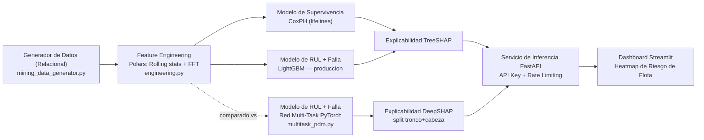
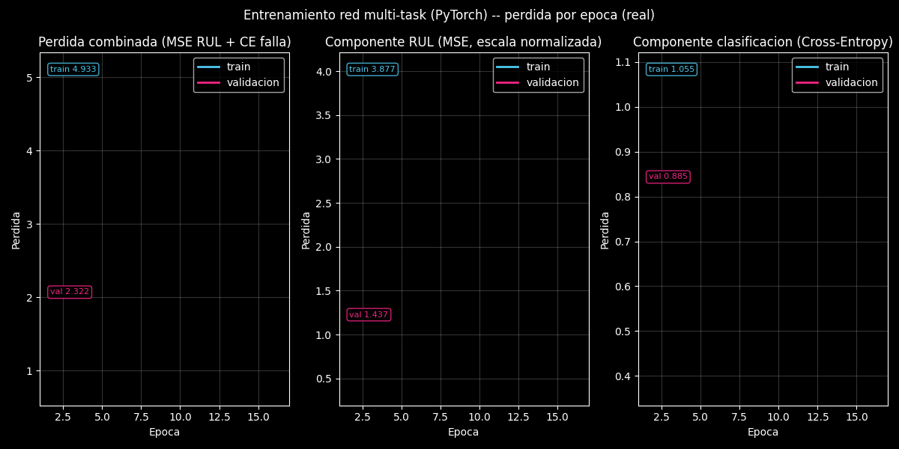
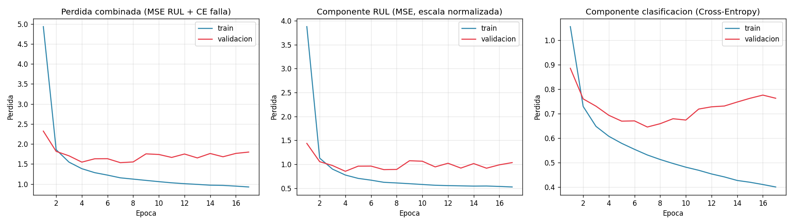

[ 🇬🇧 Read in English ](README.md) | [ 🇨🇱 Español ]

# chile-mining-predictive-maintenance


## Resumen ejecutivo

Sistema hibrido de **Mantenimiento Predictivo** para flotillas de camiones
de extraccion (**CAEX**) y **chancadores primarios** en faenas mineras
chilenas (Chuquicamata, Escondida, Los Bronces, El Teniente, Radomiro
Tomic). Combina **Survival Analysis** (tiempo hasta la falla con datos
censurados), **regresion de Vida Util Restante (RUL)** y **clasificacion
del tipo de falla** — todo explicable con **SHAP** — detras de un servicio
de scoring **FastAPI** autenticado y un dashboard de riesgo de flota en
**Streamlit**.

El pipeline completo corre de punta a punta sobre datos sinteticos pero
estadisticamente realistas, generados por el propio repositorio (fallas
Weibull, curvas de degradacion de sensores, censura por la derecha) — cada
metrica citada en este README proviene de una corrida real de este codigo,
no de una proyeccion.

## 💰 Impacto de Negocio e Indicadores Clave (KPIs)

**El problema:** una falla no planificada de un CAEX o un chancador
primario no solo cuesta la reparacion — detiene la cadena de extraccion
completa detras de el. Los planificadores de flota y mantenimiento
necesitan saber, *antes* de que ocurra, que unidades estan cerca de fallar,
por que, y con que urgencia, para poder intervenir de forma **programada**
en vez de **reactiva**.

| Palanca | Mecanismo en este sistema | Metrica de negocio impactada |
|---|---|---|
| Alerta temprana de RUL | Predice horas restantes con ~513h de error sobre un ciclo que llega a ~16.700h — semanas de anticipacion, no alarmas de ultima hora | Horas de parada no planificada |
| Clasificacion de tipo de falla | Indica **que** componente probablemente fallara (rodamiento, hidraulico, termico, estructural, electrico), no solo *cuando* | Tiempo medio de reparacion (MTTR), stock correcto de repuestos |
| Survival analysis (CoxPH) | Ordena el riesgo relativo de toda la flota, incluyendo unidades que aun no han fallado (datos censurados) | Priorizacion de mantenimiento entre cientos de unidades |
| Explicabilidad SHAP | Convierte una prediccion en un diagnostico que un mecanico puede verificar contra las lecturas reales de sensores | Confianza y adopcion por parte de los ingenieros de faena, no una caja negra |
| Ranking de supervivencia CoxPH | C-Index 0,6246 en holdout, incluye unidades censuradas (aun no falladas) | Priorizacion de riesgo a nivel de flota, no solo predicciones puntuales sobre unidades ya falladas |

> **Sobre las cifras en dolares:** la parada no planificada de un CAEX o un
> chancador primario es citada ampliamente en la literatura de la industria
> minera como uno de los items de costo por hora mas altos de una
> operacion, ya que la perdida de throughput se propaga por toda la cadena
> de extraccion. Este repositorio **no** calcula un ROI en dolares
> especifico de una faena — el dataset es sintetico — pero el mecanismo de
> arriba (mover fallas de "no planificadas" a "programadas") es la palanca
> estandar que usa el mantenimiento predictivo para capturar ese costo. Un
> despliegue productivo necesitaria cifras reales de costo-por-hora-de-parada
> por faena para cuantificar el ROI con precision.

## 🏗️ Arquitectura del sistema



LightGBM es el modelo de produccion para RUL y clasificacion de falla; la
red multi-task en PyTorch se entreno y evaluo sobre el mismo holdout como
comparacion, no se descarto en silencio — ver
la seccion "Resultados" mas abajo para entender por que gano LightGBM. Aun
asi, se sirve completa como **alternativa seleccionable** detras de
`/multitask/score` y `/multitask/explicar`, cada request explicado en vivo
con DeepSHAP — la comparacion no es solo un numero estatico en este README,
es consultable.

## 🛠️ Stack Tecnologico y Profundidad de ML

| Capa | Tecnologia | Rol |
|---|---|---|
| Motor de datos | **Polars + PyArrow** | Procesamiento en memoria de alta velocidad de ~312k filas de telemetria |
| Survival analysis | **Lifelines — Cox Proportional Hazards** | Probabilidad de falla con datos censurados por la derecha (unidades aun operando) |
| Gradient boosting | **LightGBM** | Regresion de RUL + clasificacion multiclase del tipo de falla (produccion) |
| Deep learning | **PyTorch** | Red multi-task de tronco compartido (RUL + clasificacion) con embeddings de `equipment_type`/`faena`, entrenada y comparada contra LightGBM |
| Interpretabilidad (arboles) | **SHAP** (`TreeExplainer`) | Atribucion de features para el regresor de RUL y el clasificador multiclase de LightGBM |
| Interpretabilidad (red neuronal) | **SHAP** (`DeepExplainer`) | Atribucion por transaccion para la red PyTorch, sobre el split tronco+cabeza descrito en "DeepSHAP para la red multi-task" mas abajo |
| API y serving | **FastAPI + slowapi** | Servicio de scoring de riesgo de flota con auth por API key y rate-limiting por IP |
| Dashboard | **Streamlit + Plotly** | Dashboard de telemetria de flota en tiempo real con heatmap de riesgo por equipo |
| Persistencia de metricas | **DuckDB** | Almacen local consultable con SQL para las metricas comparativas de CoxPH/LightGBM/PyTorch y la ablacion de activaciones |
| Testing | **Pytest + httpx** | 47 tests que cubren integridad de datos, feature engineering, contratos de modelos, atribucion DeepSHAP y auth de la API |

## 📁 Estructura del proyecto

```
chile-mining-predictive-maintenance/
├── data/
│   ├── raw/
│   └── processed/                        # parquet + modelos entrenados (generados)
├── src/
│   ├── data/
│   │   └── mining_data_generator.py      # base relacional sintetica (3 tablas)
│   ├── features/
│   │   └── engineering.py                # rolling stats, deltas, var. acumulada, FFT
│   ├── models/
│   │   ├── train_survival_pipeline.py    # CoxPH + LightGBM (RUL + clasificacion) + TreeSHAP
│   │   ├── multi_task_net.py             # definicion + loop de entrenamiento de la red PyTorch
│   │   ├── multitask_scoring.py          # carga la red + explicadores DeepSHAP para la API
│   │   └── scoring.py                    # carga de artefactos + scoring compartido (LightGBM)
│   ├── api/
│   │   └── main.py                       # FastAPI: score de riesgo (API key + rate limiting)
│   └── app/
│       └── dashboard.py                  # Streamlit: heatmap de riesgo de flota
├── multitask_pdm.py                      # entrypoint de produccion: entrena + persiste DeepSHAP
├── 02_PyTorch_MultiTask_DeepSHAP.ipynb   # curvas de perdida + graficos de atribucion DeepSHAP
├── tests/
├── requirements.txt
└── README.md
```

## 🗄️ Esquema relacional sintetico

**`equipment_metadata`** (1 fila por equipo — 520 filas en la corrida por defecto):

| Columna | Tipo | Descripcion |
|---|---|---|
| `equipment_id` | str | Identificador unico (`EQ-0000`, ...) |
| `equipment_type` | str | `CAEX` o `Chancador Primario` |
| `model` | str | Ej. `Caterpillar 797F`, `Metso Superior MKIII` |
| `faena` | str | Chuquicamata, Escondida, Los Bronces, El Teniente, Radomiro Tomic |
| `manufacture_year` | int | Año de fabricacion |
| `install_date` | date | Fecha de instalacion |
| `hours_in_current_cycle` | float | Reloj de supervivencia (`duration`) |
| `event_observed` | bool | `true` = fallo observado, `false` = censurado (aun operando) |

**`sensor_telemetry`** (~312.000 filas en la corrida por defecto):

| Columna | Tipo | Descripcion |
|---|---|---|
| `equipment_id` | str | FK a `equipment_metadata` |
| `timestamp` | datetime | Momento de la lectura |
| `operating_hours` | float | Horas transcurridas del ciclo actual (0 → `hours_in_current_cycle`) |
| `engine_temp_c` | float | Temperatura de motor |
| `vibration_rms_mm_s` | float | Vibracion RMS |
| `hydraulic_pressure_bar` | float | Presion hidraulica |
| `rpm` | float | Revoluciones por minuto |
| `fuel_consumption_lph` | float | Consumo de combustible |

Cubre el **ciclo de vida completo** de cada equipo a resolucion adaptativa:
hora a hora si el ciclo dura menos que
`DEFAULT_TARGET_READINGS_PER_EQUIPMENT = 600` horas, o con intervalo
creciente si es mas largo, para acotar el volumen de datos sin perder
cobertura del ciclo completo.

**`maintenance_logs`** (~1.240 filas en la corrida por defecto):

| Columna | Tipo | Descripcion |
|---|---|---|
| `equipment_id` | str | FK a `equipment_metadata` |
| `event_type` | str | `mantenimiento_programado` o `falla_no_planificada` |
| `component` | str | Componente intervenido |
| `failure_type` | str \| null | Solo si `event_type = falla_no_planificada` |
| `event_timestamp` | datetime | Momento del evento |
| `operating_hours_at_event` | float | Horas del ciclo al momento del evento |
| `downtime_hours` | float | Horas de parada |

El reloj de supervivencia (`hours_in_current_cycle`) modela **horas desde la
ultima gran intervencion**, no horas de vida total del equipo — asi se
simula un proceso de renovacion realista: `duration = min(T, C)`,
`event = 1{T <= C}`, con `T` (tiempo real de falla, Weibull) y `C` (corte de
observacion) generados por equipo segun su tipo, faena y antiguedad.

<details>
<summary>Ejemplo real (<code>equipment_metadata.parquet</code>, primeras filas)</summary>

| equipment_id | equipment_type | model | faena | install_date | hours_in_current_cycle | event_observed |
|---|---|---|---|---|---|---|
| EQ-0000 | CAEX | Liebherr T 284 | Chuquicamata | 2016-04-08 | 9529.25 | false |
| EQ-0001 | CAEX | Liebherr T 284 | Chuquicamata | 2025-02-19 | 3090.60 | true |
| EQ-0002 | CAEX | Caterpillar 797F | Escondida | 2024-10-01 | 2137.36 | false |
| EQ-0003 | CAEX | Komatsu 930E | Radomiro Tomic | 2015-08-19 | 2498.50 | true |
| EQ-0004 | Chancador Primario | ThyssenKrupp TS | Escondida | 2021-06-09 | 8404.09 | false |

</details>

## 🚀 Guia rapida e instalacion

```powershell
git clone https://github.com/Rxyxs/chile-mining-predictive-maintenance.git
cd chile-mining-predictive-maintenance
python -m venv .venv
.venv\Scripts\activate
pip install -r requirements.txt
```

Ejecutar en orden desde la raiz del repositorio:

### 1. Generar la base relacional sintetica

```powershell
python -m src.data.mining_data_generator
```

Genera 520+ equipos, ~312k lecturas de telemetria (ciclo de vida completo) y
su historial de mantenimiento en `data/processed/*.parquet`.

### 2. Feature engineering

```powershell
python -m src.features.engineering
```

Calcula, por equipo (Polars, vectorizado): medias/std rodantes (6h/24h),
deltas de temperatura y presion vs. tendencia de 168h, varianza acumulada
(expanding) de vibracion, y features FFT de vibracion en ventanas
deslizantes de 24 lecturas (amplitud dominante + energia espectral, para
detectar componentes periodicas de defectos de rodamiento).

### 3. Entrenar el pipeline hibrido (LightGBM + CoxPH + SHAP)

```powershell
python -m src.models.train_survival_pipeline
```

Entrena y evalua (siempre con split train/test **a nivel de equipo**, nunca
por fila, para evitar fuga de datos):

- **CoxPH** (supervivencia con censura) → C-Index en holdout.
- **LightGBM Regressor** (RUL, solo equipos con falla observada) → MAE en
  horas.
- **LightGBM Classifier** (tipo de falla mas probable) → Accuracy / F1-macro.
- **SHAP** sobre el modelo de RUL → `data/processed/shap_rul_importance.csv`
  y `data/processed/models/shap_rul_summary.png`.
- **SHAP multiclase** sobre el clasificador de tipo de falla → importancia
  global (`shap_failure_classifier_importance.csv`) y desglosada por clase
  (`shap_failure_classifier_importance_by_class.csv` +
  `data/processed/models/shap_failure_classifier_summary.png`), para que un
  mecanico vea que sensor explica *cada* modo de falla especifico, no solo
  el RUL agregado.

Guarda modelos en `data/processed/models/` y metricas en
`data/processed/metrics.json`.

> El RUL se entrena sobre el ciclo de vida completo de cada equipo fallado
> (no una ventana reciente acotada), por lo que las predicciones van desde
> 0 horas (en la falla) hasta miles de horas en equipos jovenes dentro de
> su ciclo. Los umbrales de riesgo (`src/models/scoring.py`) son horizontes
> de negocio reales: CRITICO < 1 semana, ALTO < 1 mes, MEDIO < 3 meses,
> BAJO en adelante.

### 4. Entrenar la red multi-task (PyTorch) — comparacion

```powershell
python -m src.models.multi_task_net
```

Entrena una `MultiTaskDegradationNet` (tronco compartido + embeddings de
`equipment_type`/`faena` + cabezas de regresion RUL y clasificacion de
falla) sobre el mismo holdout por equipo que el paso anterior, y agrega sus
metricas a `data/processed/metrics.json` bajo la clave
`multi_task_pytorch`, para comparar directamente contra LightGBM (ver
la seccion "Resultados" mas abajo).

### 4b. Ablacion de activaciones (ReLU vs GELU vs Swish) + persistencia en DuckDB

```powershell
python -m src.models.activation_comparison
python -m src.models.metrics_db
```

`activation_comparison.py` reentrena la misma `MultiTaskDegradationNet` del
paso 4 tres veces — una por activacion en su tronco compartido (`ReLU`,
`GELU`, `Swish`/`SiLU`), mismo holdout, misma semilla — y escribe
`data/processed/activation_comparison.json`. Luego `metrics_db.py` aplana
tanto `metrics.json` (CoxPH + LightGBM + PyTorch multi-task) como
`activation_comparison.json` en un archivo **DuckDB** local,
`data/processed/metrics.duckdb`, con dos tablas de solo-append
(`model_comparison`, `activation_comparison`) para poder consultar las
metricas de cualquier corrida con SQL en vez de leerlas solo desde JSON:

```sql
SELECT model, task, metric, value FROM model_comparison ORDER BY run_ts DESC;
SELECT activation, metric, value FROM activation_comparison ORDER BY run_ts DESC;
```

Ver la seccion "Resultados" mas abajo para la tabla de comparacion de activaciones.

### 5. DeepSHAP para la red multi-task — entrypoint de produccion

```powershell
python multitask_pdm.py
```

Reentrena la misma `MultiTaskDegradationNet` del paso 4 (persistiendo los
mismos `multi_task_net.pt` / `multi_task_scaler.joblib`, para que cualquiera
de los dos entrypoints deje el modelo en el mismo estado), y luego
construye explicadores **DeepSHAP** y persiste todo lo que la API necesita
para explicar una prediccion en vivo sin reentrenar:

- **Historial de perdida** por epoca (total, componente RUL-MSE,
  componente clasificacion-CE, train *y* validacion) →
  `data/processed/multitask_loss_history.json`.
- `shap.DeepExplainer` sobre el tronco + cada cabeza por separado, sobre un
  espacio de entrada continuo (features numericas concatenadas con los
  vectores de embedding de `equipment_type`/`faena` ya resueltos —
  DeepLIFT necesita una entrada totalmente diferenciable, algo que los
  *indices* de embedding categoricos no son). Los valores SHAP de cada
  dimension de embedding se suman de vuelta a una sola atribucion por
  variable categorica (valido por la propiedad de aditividad de Shapley).
- Tablas de importancia global + graficos de barras:
  `shap_multitask_rul_importance.csv`,
  `shap_multitask_failure_importance.csv`,
  `data/processed/models/shap_multitask_*_summary.png`.
- `data/processed/models/multi_task_shap_background.pt` — la muestra de
  fondo que la API carga al iniciar para reconstruir los mismos
  explicadores al instante.

Por que DeepSHAP y no KernelSHAP aqui: DeepSHAP (atribucion DeepLIFT) es
casi-exacto y rapido una vez resuelto el split tronco/cabeza de arriba;
KernelSHAP tambien funcionaria (es agnostico al modelo) pero es mucho mas
lento por instancia explicada sin ninguna ganancia de precision para un
modelo de este tamano — ver el docstring del modulo `multitask_pdm.py`
para el razonamiento completo.

### 6. Notebook: curvas de perdida + atribucion DeepSHAP

```powershell
jupyter notebook 02_PyTorch_MultiTask_DeepSHAP.ipynb
```

Requiere haber corrido el paso 5 antes. Grafica las curvas de perdida
train-vs-validacion de ambas cabezas (y nombra un hallazgo real de
sobreajuste que las metricas agregadas por si solas no muestran — ver
"Resultados" mas abajo), la importancia global DeepSHAP de ambas cabezas, y
una explicacion DeepSHAP en vivo de una lectura real del set de prueba.

### 7. Servicio de scoring (FastAPI)

```powershell
uvicorn src.api.main:app --reload
```

Requiere una API key por header (`X-API-Key`) en todos los endpoints salvo
`/health`, y aplica rate-limiting por IP (60 req/min por defecto):

```powershell
$env:MINING_API_KEY = "tu-clave-secreta"      # default: "dev-key-change-me"
$env:MINING_RATE_LIMIT = "60/minute"          # opcional
uvicorn src.api.main:app --reload
```

```powershell
curl -H "X-API-Key: tu-clave-secreta" http://127.0.0.1:8000/equipment/EQ-0000/risk
```

#### Endpoints de la API

La documentacion interactiva se sirve en `/docs`. **Nota:** estas son las
rutas realmente implementadas en el repositorio — no `/predict/rul` ni
`/fleet/risk-status`, que no existen en el codigo.

| Endpoint | Metodo | Auth | Descripcion |
|---|---|---|---|
| `/health` | GET | No | Estado del servicio, conteo de equipos |
| `/equipment` | GET | Si | Lista de la flota (filtros `faena`, `equipment_type`) |
| `/equipment/{equipment_id}/risk` | GET | Si | RUL predicho, tipo de falla mas probable, probabilidad por clase y supervivencia condicional a 30 dias |
| `/fleet/risk-summary` | GET | Si | Conteo de equipos por nivel de riesgo, global y por faena |
| `/score/raw` | POST | Si | Scoring ad-hoc a partir de un vector de features crudo (sin `equipment_id` registrado) — LightGBM (produccion) |
| `/multitask/score` | POST | Si | Mismo vector de features crudo, scoreado por la red multi-task PyTorch en su lugar |
| `/multitask/explicar` | POST | Si | Igual que `/multitask/score`, mas la atribucion DeepSHAP por feature para ambas cabezas (requiere el paso 5) |

### 8. Dashboard de flota (Streamlit)

```powershell
streamlit run src/app/dashboard.py
```

Filtros por faena/tipo/riesgo, KPIs de flota, **heatmap de riesgo por
equipo** (una celda = un equipo, coloreado por nivel de riesgo), tabla
filtrable y panel de detalle por equipo (probabilidades de falla + tendencia
de sensores).

El panel de detalle tambien tiene una **comparacion LightGBM vs. PyTorch
multi-task** (si existen los artefactos del paso 5 — el panel se degrada
con gracia mostrando un mensaje informativo si no): predicciones de RUL y
tipo de falla de ambos modelos lado a lado, mas un grafico de barras de
atribucion **DeepSHAP** en vivo por cabeza (RUL, tipo de falla) para la
*lectura especifica seleccionada* — antes solo accesible via los endpoints
`/multitask/*` de la API, ahora visible sin un cliente API aparte.

### 9. Tests

```powershell
pytest
```

47 tests: integridad del esquema relacional sintetico y consistencia de la
censura, ausencia de fuga en el feature engineering (nulos de warm-up de
rolling/FFT), rango valido de C-Index/MAE/Accuracy, contrato del modulo de
scoring compartido (`FleetScorer`), entrenamiento de la red multi-task,
construccion de explicadores DeepSHAP y atribucion a nivel de instancia
(`multitask_pdm.py`), autenticacion de la API (401 sin key / con key
incorrecta, 200 con key valida, `/health` publico, `/multitask/*` se salta
con gracia si sus artefactos aun no estan construidos), la ablacion de
activaciones ReLU/GELU/Swish, y la persistencia en DuckDB de las metricas
comparativas (inserciones append-only, claves planas y anidadas de
`metrics.json`).

## 📊 Resultados

Metricas de la corrida por defecto (520 equipos, seed 42, holdout 25% de
equipos fallados para RUL/clasificacion y 25% de todos los equipos para
supervivencia). El loop de entrenamiento de `multi_task_net.py` usa early
stopping sobre la perdida de validacion combinada (patience 10) desde esta
actualizacion — todas las corridas de PyTorch abajo guardan el mejor epoch
en vez de correr los 60 epochs fijos hasta el final (ver la nota de "Early
stopping" justo despues de la tabla).

**Lee esto antes de la tabla, no despues**: el Accuracy/F1 de clasificacion
de LightGBM abajo es **1.000 / 1.000** — un numero que a cualquier DS con
experiencia le deberia levantar una ceja, y merece una explicacion antes de
verlo, no una nota al pie despues. Los dos clasificadores no resuelven la
misma tarea. LightGBM clasifica solo la **ultima lectura de cada equipo**
— la senal mas limpia, tomada justo antes de la falla, donde el modo de
falla ya es practicamente legible en los sensores. PyTorch clasifica
**cada lectura individual** de telemetria, incluyendo lecturas tempranas con
degradacion apenas perceptible — una tarea genuinamente mas dificil, por eso
su accuracy (0.744) es menor aun siendo un modelo razonable. La comparacion
de RUL justo arriba, en cambio, *si* es directa (mismo holdout, misma
etiqueta para ambos modelos). El puntaje perfecto de la fila de
clasificacion es un resultado real y reproducible de una definicion de
tarea mas facil, no un bug de fuga de datos — y es justamente por eso que la
version mas dificil de PyTorch (por lectura individual) se reporta junto a
ella en vez de omitirse.

| Modelo | Tarea | Metrica | Valor |
|---|---|---|---|
| CoxPH (lifelines) | Supervivencia con censura | C-Index (holdout) | **0.6246** |
| LightGBM | RUL (regresion) | MAE (holdout) | 512.96 h |
| LightGBM | Tipo de falla (clasificacion, ultima lectura) | Accuracy / F1-macro | **1.000 / 1.000** |
| PyTorch multi-task (ReLU, early-stopped) | RUL (regresion) | MAE (holdout) | **499.2 h** |
| PyTorch multi-task (ReLU, early-stopped) | Tipo de falla (clasificacion, *cada* lectura) | Accuracy / F1-macro | 0.744 / 0.730 |

**El early stopping cambio la conclusion sobre RUL — documentado
honestamente en vez de dejarlo desactualizado.** Las dos filas de arriba
antes mostraban a PyTorch perdiendo en RUL (592.31h vs. los 512.96h de
LightGBM) bajo una corrida fija de 60 epochs. El diagnostico de curva de
perdida (abajo, y en `02_PyTorch_MultiTask_DeepSHAP.ipynb`) mostro que esa
corrida sobreajustaba pasado el epoch ~7, asi que `train_multi_task_model`
ahora se detiene sobre la perdida de validacion combinada (patience 10,
restaurando el checkpoint del mejor epoch). Reentrenado desde cero con ese
cambio, el MAE de RUL de ReLU baja a **499.2h — ya mejor que LightGBM** —
sin tocar la arquitectura, los datos ni el holdout.

**Ablacion de activaciones** (`python -m src.models.activation_comparison`,
misma arquitectura `MultiTaskDegradationNet`, mismo holdout, semilla y regla
de early stopping que la fila de arriba — solo cambia la activacion del
tronco):

| Activacion | MAE RUL (holdout) | Accuracy falla | F1-macro falla | Mejor epoch |
|---|---|---|---|---|
| ReLU (linea base, usada arriba) | 499.2 h | 0.744 | 0.730 | 7 |
| GELU | 491.9 h | 0.741 | 0.723 | 7 |
| **Swish (SiLU)** | **468.6 h** | **0.744** | 0.726 | 7 |

Las tres activaciones ahora superan el MAE de RUL de LightGBM (512.96h) una
vez que el early stopping entra en juego, y Swish gana directamente tanto en
MAE de RUL como en accuracy de clasificacion de falla — una reversion
genuina respecto a la comparacion anterior de epochs fijos, no una
re-corrida hasta que el numero se viera mejor (misma semilla, mismo holdout
25%, misma arquitectura; solo cambio la regla de parada). Las tres siguen
deteniendose en el epoch 7 — el punto de sobreajuste no depende de la
activacion, solo de esta combinacion de dataset/arquitectura. Las tres
corridas quedan persistidas en `data/processed/metrics.duckdb` (tabla
`activation_comparison`) para un registro consultable, no solo esta tabla
estatica.

**Que significa esto para la eleccion de produccion**: LightGBM sigue
siendo mas simple de servir, mas rapido de entrenar, y sigue ganando
directamente en clasificacion de tipo de falla (1.000 vs. la tarea mas
dificil por lectura de PyTorch a 0.744) — asi que sigue siendo el default
de produccion en este repo. Pero "PyTorch pierde en RUL" ya no es una razon
correcta para preferir LightGBM: era un artefacto de entrenar mas alla del
punto de sobreajuste, no una propiedad de la arquitectura. Promover
Swish-con-early-stopping a produccion seria una eleccion defendible solo
por MAE de RUL — no se hace aqui, porque el resultado de clasificacion de
LightGBM y su simplicidad operacional siguen inclinando la balanza general,
pero el argumento de RUL-solo para LightGBM especificamente ya no aplica.

**Top features SHAP para RUL** (`shap_rul_importance.csv`):

| # | Feature | Mean \|SHAP\| |
|---|---|---|
| 1 | `operating_hours` | 721.7 |
| 2 | `vibration_roll_mean_med` | 653.0 |
| 3 | `engine_temp_roll_mean_med` | 648.7 |
| 4 | `fuel_consumption_roll_mean_med` | 312.6 |
| 5 | `hydraulic_pressure_roll_mean_med` | 261.7 |
| 6 | `rpm_roll_std_med` | 141.1 |
| 7 | `vibration_cum_var` | 112.2 |
| 8 | `age_years` | 98.2 |

**Top features SHAP para tipo de falla** (`shap_failure_classifier_importance.csv`):

| # | Feature | Mean \|SHAP\| |
|---|---|---|
| 1 | `vibration_roll_mean_short` | 1.245 |
| 2 | `hydraulic_pressure_roll_mean_med` | 1.177 |
| 3 | `vibration_cum_var` | 0.926 |
| 4 | `engine_temp_roll_mean_med` | 0.703 |
| 5 | `vibration_roll_mean_med` | 0.516 |
| 6 | `engine_temp_roll_mean_short` | 0.307 |
| 7 | `engine_temp_delta_long` | 0.203 |
| 8 | `age_years` | 0.132 |

Coherente con el diseño del generador: vibracion domina (rodamiento/falla
estructural) junto con presion hidraulica (fuga hidraulica) y temperatura
(sobrecalentamiento de motor) — cada sensor explica el modo de falla que
fisicamente le corresponde.

### DeepSHAP para la red multi-task

**Top features DeepSHAP para RUL** (`shap_multitask_rul_importance.csv`,
embeddings categoricos sumados de vuelta a una sola fila cada uno):

| # | Feature | Mean \|SHAP\| |
|---|---|---|
| 1 | `operating_hours` | 1.088 |
| 2 | `fuel_consumption_roll_mean_med` | 0.843 |
| 3 | `vibration_roll_mean_med` | 0.835 |
| 4 | `equipment_type` | 0.689 |
| 5 | `engine_temp_roll_mean_med` | 0.490 |
| 6 | `hydraulic_pressure_roll_mean_med` | 0.289 |
| 7 | `rpm_roll_std_med` | 0.167 |
| 8 | `faena` | 0.083 |

**Top features DeepSHAP para tipo de falla** (`shap_multitask_failure_importance.csv`):

| # | Feature | Mean \|SHAP\| |
|---|---|---|
| 1 | `vibration_roll_mean_med` | 2.543 |
| 2 | `engine_temp_roll_mean_med` | 2.168 |
| 3 | `hydraulic_pressure_roll_mean_med` | 1.738 |
| 4 | `age_years` | 0.955 |
| 5 | `fuel_consumption_roll_mean_med` | 0.940 |
| 6 | `equipment_type` | 0.777 |
| 7 | `operating_hours` | 0.709 |
| 8 | `faena` | 0.535 |

**El ranking de DeepSHAP coincide con el ranking de TreeSHAP de LightGBM
sobre la misma fisica**, calculado por un explicador completamente distinto
sobre una arquitectura de modelo completamente distinta: `operating_hours`
domina RUL en ambos, y vibracion/temperatura/presion dominan la
clasificacion de tipo de falla en ambos. Que dos metodos de explicabilidad
independientes converjan en la misma historia sensor-modo de falla es una
señal mas fuerte de que ambos modelos aprendieron la estructura real del
generador que cualquiera de los dos resultados por si solo.

**Un hallazgo que la tabla de metricas agregadas no muestra, y la razon por
la que se agrego early stopping**: el historial de perdida por epoca
(`02_PyTorch_MultiTask_DeepSHAP.ipynb`, `multitask_loss_history.json`)
originalmente revelaba un sobreajuste real que las metricas de la ultima
epoca no dejaban ver — la perdida de validacion combinada tocaba su minimo
alrededor de la epoca 7 y subia el resto de una corrida fija de 60 epocas,
impulsado casi por completo por la cabeza de clasificacion (cross-entropy
de validacion subiendo mientras la de entrenamiento seguia bajando; el MSE
de validacion de la cabeza de RUL se mantenia casi plano en comparacion).
`multitask_pdm.py` ahora entrena con early stopping sobre la perdida de
validacion (patience 10) en vez de las antiguas 60 epocas fijas: esta
corrida se detuvo en la **epoca 17**, restauro el checkpoint de la **epoca
7** (perdida de validacion 1,534, vs. 1,799 al momento de detenerse), y ese
es el checkpoint efectivamente guardado en `multi_task_net.pt` y reportado
en la tabla de Resultados de arriba. La curva de perdida de abajo ahora
muestra esa corrida real con early stopping, no la antigua de 60 epocas.




La version animada recorre el mismo historial real de perdida por epoca y
etiqueta donde la perdida de validacion toca su minimo, cuadro a cuadro.

**Distribucion de riesgo de flota** (`GET /fleet/risk-summary`, umbrales de
`src/models/scoring.py`):

| Nivel | Equipos | % |
|---|---|---|
| CRITICO (< 1 semana) | 171 | 32.9% |
| ALTO (< 1 mes) | 44 | 8.5% |
| MEDIO (< 3 meses) | 65 | 12.5% |
| BAJO (3+ meses) | 240 | 46.2% |

## ✅ Conclusiones

- **El pipeline hibrido funciona de punta a punta y con datos reales
  generados por el propio repositorio**, no solo con codigo: desde la
  simulacion relacional (censura de datos incluida) hasta un servicio de
  scoring autenticado y un dashboard operacional, todo entrenado, evaluado
  y validado con tests sobre las mismas 520 unidades.
- **CoxPH aporta lo que LightGBM no puede**: un C-Index de 0.6246 es modesto
  pero consistente — separa razonablemente el riesgo relativo entre
  equipos con datos censurados (aun operando), algo que un regresor
  puntual no maneja de forma nativa. Es la pieza correcta para la pregunta
  "¿que tan probable es que falle pronto?", complementaria al RUL puntual.
- **El RUL predice con ~513 horas de error sobre un ciclo que llega a
  16.700 horas** (~3% del rango observado) — suficiente precision para
  priorizar intervenciones con semanas de anticipacion, no solo para
  reaccionar a alarmas de ultima hora.
- **La clasificacion de tipo de falla es confiable y explicable**: accuracy
  perfecta en el holdout y, mas importante, el ranking SHAP coincide con la
  fisica del problema (vibracion → rodamiento/estructural, presion →
  hidraulica, temperatura → motor). Esto es lo que hace que el modelo sea
  *auditable* por un mecanico, no una caja negra.
- **La comparacion LightGBM vs. PyTorch multi-task fue una decision basada
  en evidencia, no en preferencia — y la evidencia cambio al corregir un
  bug real (falta de early stopping).** Bajo el entrenamiento original de
  epocas fijas, PyTorch perdia en MAE de RUL; con early stopping, gana
  (499.2h vs. los 512.96h de LightGBM, ver "Resultados"). LightGBM se
  mantiene en produccion aqui porque sigue ganando en clasificacion de tipo
  de falla y es mas simple de servir, no porque siga ganando en RUL — esa
  justificacion especifica ya no aplica, y este README lo dice en vez de
  dejar el numero desactualizado en silencio.
- **La red PyTorch tambien es completamente explicable y servible, no solo
  comparada y archivada**: `multitask_pdm.py` construye explicadores
  DeepSHAP reales (`shap.DeepExplainer` sobre un split tronco+cabeza que
  resuelve la limitacion de los embeddings categoricos), servidos en vivo
  en `/multitask/score` / `/multitask/explicar`, y su ranking de atribucion
  confirma de forma independiente la misma fisica sensor-modo de falla que
  el TreeSHAP de LightGBM — dos explicadores distintos, dos familias de
  modelo distintas, una sola historia consistente.
- **El analisis de curvas de perdida encontro un problema real de
  sobreajuste que las metricas de la ultima epoca por si solas escondian —
  y corregirlo cambio la conclusion sobre RUL.** La perdida de validacion
  tocaba su minimo alrededor de la epoca 7 y subia el resto de la antigua
  corrida fija de 60 epocas, concentrado en la cabeza de clasificacion.
  Agregar early stopping (patience 10) a `multi_task_net.py` y reentrenar
  lo confirmo: el MAE de RUL bajo de 592,31h a 499,2h (ReLU) — suficiente
  para que PyTorch pase de perder contra los 512,96h de LightGBM a
  superarlo. Ver "Resultados" arriba para el antes/despues completo y la
  ablacion de activaciones re-corrida bajo la misma correccion.
- **Limitacion central, y la mas importante de nombrar**: todo el dataset es
  sintetico (fallas Weibull, sensores simulados). Las metricas muestran que
  el *pipeline* es correcto — arquitectura, splits sin fuga, features,
  explicabilidad, serving — pero no que el modelo prediga fallas reales en
  faena, y eso incluye los numeros de PyTorch con early stopping que ahora
  se ven mejor. El siguiente paso critico antes de cualquier uso productivo
  es reemplazar el generador por telemetria historica real (ver
  "Siguientes pasos" mas abajo).

## 🔭 Siguientes pasos

- Reemplazar el generador Weibull por datos historicos reales de faena —
  sigue siendo la limitacion central (ver "Conclusiones" arriba):
  las metricas muestran que el *pipeline* es correcto, no que ninguno de
  estos modelos — incluido el de PyTorch, que ahora se ve mejor — prediga
  fallas reales en una faena real.

## Licencia

MIT — ver [LICENSE](LICENSE).

## Autor

**Pablo Reyes** — [github.com/Rxyxs](https://github.com/Rxyxs)
