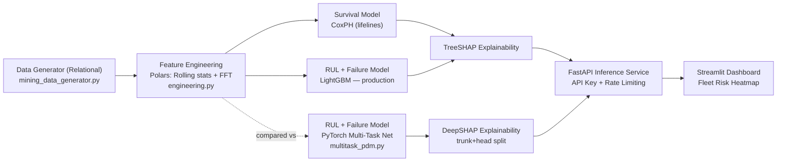

**🇨🇱 [Leer en Español](README.es.md)** &nbsp;|&nbsp; US English (this page)

# chile-mining-predictive-maintenance


## Executive Summary

A hybrid **Predictive Maintenance** system for haul truck (**CAEX**) and
**primary crusher** fleets across Chilean mining operations (Chuquicamata,
Escondida, Los Bronces, El Teniente, Radomiro Tomic). It combines
**Survival Analysis** (time-to-failure with censored data), **Remaining
Useful Life (RUL) regression**, and **failure-mode classification** — all
explainable via **SHAP** — behind an authenticated **FastAPI** scoring
service and a **Streamlit** fleet-risk dashboard.

The full pipeline runs end to end on synthetic but statistically realistic
data generated by the repository itself (Weibull time-to-failure, sensor
degradation curves, right-censoring) — every metric quoted in this README
comes from an actual run of this code, not a projection.

## 💰 Business Impact & Key Performance Indicators

**The problem:** an unplanned failure of a CAEX or a primary crusher doesn't
just cost the repair — it stalls the extraction chain behind it. Fleet and
maintenance planners need to know, *before* it happens, which units are
close to failing, why, and how urgently, so intervention can be **scheduled**
instead of **reactive**.

| Lever | Mechanism in this system | Business metric it targets |
|---|---|---|
| Early RUL warning | Predicts remaining hours with ~513h MAE over a cycle that spans up to ~16,700h — weeks of lead time, not last-minute alarms | Unplanned downtime hours |
| Failure-mode classification | Tells the crew **which** component is likely to fail (bearing, hydraulic, thermal, structural, electrical), not just *when* | Mean time to repair (MTTR), correct spare-parts staging |
| Survival analysis (CoxPH) | Ranks relative risk across the whole fleet, including units that haven't failed yet (censored data) | Maintenance prioritization across hundreds of units |
| SHAP explainability | Turns a prediction into a diagnosis a mechanic can verify against real sensor readings | Trust and adoption by field engineers, not a black box |
| CoxPH survival ranking | C-Index 0.6246 on holdout, includes censored (not-yet-failed) units | Fleet-wide relative risk prioritization, not just point predictions on failed units |

> **On dollar figures:** unplanned downtime for a CAEX or primary crusher is
> widely cited in mining-industry literature as one of the highest
> per-hour cost items in an operation, since lost throughput cascades
> through the whole extraction chain. This repository does **not** compute a
> site-specific dollar ROI — the dataset is synthetic — but the mechanism
> above (moving failures from "unplanned" to "scheduled") is the standard
> lever predictive maintenance uses to capture that cost. A production
> deployment would need real cost-per-downtime-hour figures per site to
> quantify ROI precisely.

## 🏗️ System Architecture



LightGBM is the production model for RUL and failure classification; the
PyTorch multi-task network was trained and evaluated on the identical
holdout as a comparison, not silently discarded — see
the "Results" section below for why LightGBM won. It's fully served,
though, as a **selectable alternative** behind `/multitask/score` and
`/multitask/explicar`, each request explained live with DeepSHAP — so the
comparison isn't just a static number in this README, it's queryable.

## 🛠️ Tech Stack & ML Depth

| Layer | Technology | Role |
|---|---|---|
| Data engine | **Polars + PyArrow** | High-throughput in-memory processing of ~312k telemetry rows |
| Survival analysis | **Lifelines — Cox Proportional Hazards** | Failure probability with right-censored data (units still operating) |
| Gradient boosting | **LightGBM** | RUL regression + multiclass failure-type classification (production) |
| Deep learning | **PyTorch** | Shared-trunk multi-task network (RUL + classification) with `equipment_type`/`faena` embeddings, trained and benchmarked against LightGBM |
| Interpretability (trees) | **SHAP** (`TreeExplainer`) | Feature attribution for both the LightGBM RUL regressor and the multiclass classifier |
| Interpretability (neural net) | **SHAP** (`DeepExplainer`) | Per-transaction attribution for the PyTorch net, on the trunk+head split described in "DeepSHAP for the multi-task net" below |
| API & serving | **FastAPI + slowapi** | Fleet risk-scoring service with API-key auth and per-IP rate limiting |
| Dashboard | **Streamlit + Plotly** | Real-time fleet telemetry dashboard with a per-equipment risk heatmap |
| Metrics persistence | **DuckDB** | Local SQL-queryable store for comparative metrics across CoxPH/LightGBM/PyTorch and the activation ablation |
| Testing | **Pytest + httpx** | 47 tests covering data integrity, feature engineering, model contracts, DeepSHAP attribution, and API auth |

## 📁 Project Structure

```
chile-mining-predictive-maintenance/
├── data/
│   ├── raw/
│   └── processed/                        # parquet + trained models (generated)
├── src/
│   ├── data/
│   │   └── mining_data_generator.py      # synthetic relational base (3 tables)
│   ├── features/
│   │   └── engineering.py                # rolling stats, deltas, cum. variance, FFT
│   ├── models/
│   │   ├── train_survival_pipeline.py    # CoxPH + LightGBM (RUL + classification) + TreeSHAP
│   │   ├── multi_task_net.py             # PyTorch multi-task net definition + training loop
│   │   ├── multitask_scoring.py          # loads the net + DeepSHAP explainers for the API
│   │   └── scoring.py                    # artifact loading + shared scoring logic (LightGBM)
│   ├── api/
│   │   └── main.py                       # FastAPI: risk scoring (API key + rate limiting)
│   └── app/
│       └── dashboard.py                  # Streamlit: fleet risk heatmap
├── multitask_pdm.py                      # production entrypoint: train + persist DeepSHAP artifacts
├── 02_PyTorch_MultiTask_DeepSHAP.ipynb   # loss curves + DeepSHAP attribution plots
├── tests/
├── requirements.txt
└── README.md
```

## 🗄️ Synthetic Relational Schema

**`equipment_metadata`** (1 row per unit — 520 rows in the default run):

| Column | Type | Description |
|---|---|---|
| `equipment_id` | str | Unique identifier (`EQ-0000`, ...) |
| `equipment_type` | str | `CAEX` or `Chancador Primario` (primary crusher) |
| `model` | str | E.g. `Caterpillar 797F`, `Metso Superior MKIII` |
| `faena` | str | Chuquicamata, Escondida, Los Bronces, El Teniente, Radomiro Tomic |
| `manufacture_year` | int | Manufacturing year |
| `install_date` | date | Installation date |
| `hours_in_current_cycle` | float | Survival clock (`duration`) |
| `event_observed` | bool | `true` = failure observed, `false` = censored (still operating) |

**`sensor_telemetry`** (~312,000 rows in the default run):

| Column | Type | Description |
|---|---|---|
| `equipment_id` | str | FK to `equipment_metadata` |
| `timestamp` | datetime | Reading timestamp |
| `operating_hours` | float | Hours elapsed in the current cycle (0 → `hours_in_current_cycle`) |
| `engine_temp_c` | float | Engine temperature |
| `vibration_rms_mm_s` | float | RMS vibration |
| `hydraulic_pressure_bar` | float | Hydraulic pressure |
| `rpm` | float | Revolutions per minute |
| `fuel_consumption_lph` | float | Fuel consumption |

Covers each unit's **full life cycle** at adaptive resolution: hourly if the
cycle is shorter than `DEFAULT_TARGET_READINGS_PER_EQUIPMENT = 600` hours,
or with a growing interval if longer, to bound dataset size without losing
full-cycle coverage.

**`maintenance_logs`** (~1,240 rows in the default run):

| Column | Type | Description |
|---|---|---|
| `equipment_id` | str | FK to `equipment_metadata` |
| `event_type` | str | `mantenimiento_programado` (scheduled) or `falla_no_planificada` (unplanned failure) |
| `component` | str | Component intervened |
| `failure_type` | str \| null | Only set if `event_type = falla_no_planificada` |
| `event_timestamp` | datetime | Event timestamp |
| `operating_hours_at_event` | float | Cycle hours at the time of the event |
| `downtime_hours` | float | Downtime duration |

The survival clock (`hours_in_current_cycle`) models **hours since the last
major overhaul**, not total lifetime hours — simulating a realistic renewal
process: `duration = min(T, C)`, `event = 1{T <= C}`, with `T` (true
failure time, Weibull-distributed) and `C` (observation cutoff) generated
per unit from its type, site, and age.

<details>
<summary>Real sample (<code>equipment_metadata.parquet</code>, first rows)</summary>

| equipment_id | equipment_type | model | faena | install_date | hours_in_current_cycle | event_observed |
|---|---|---|---|---|---|---|
| EQ-0000 | CAEX | Liebherr T 284 | Chuquicamata | 2016-04-08 | 9529.25 | false |
| EQ-0001 | CAEX | Liebherr T 284 | Chuquicamata | 2025-02-19 | 3090.60 | true |
| EQ-0002 | CAEX | Caterpillar 797F | Escondida | 2024-10-01 | 2137.36 | false |
| EQ-0003 | CAEX | Komatsu 930E | Radomiro Tomic | 2015-08-19 | 2498.50 | true |
| EQ-0004 | Chancador Primario | ThyssenKrupp TS | Escondida | 2021-06-09 | 8404.09 | false |

</details>

## 🚀 Quickstart & Installation

```powershell
git clone https://github.com/Rxyxs/chile-mining-predictive-maintenance.git
cd chile-mining-predictive-maintenance
python -m venv .venv
.venv\Scripts\activate
pip install -r requirements.txt
```

Run in order from the repository root:

### 1. Generate the synthetic relational base

```powershell
python -m src.data.mining_data_generator
```

Generates 520+ units, ~312k telemetry readings (full life cycle), and their
maintenance history into `data/processed/*.parquet`.

### 2. Feature engineering

```powershell
python -m src.features.engineering
```

Computes, per unit (Polars, vectorized): rolling means/std (6h/24h),
temperature and pressure deltas vs. a 168h trend, expanding cumulative
variance of vibration, and FFT vibration features over 24-reading sliding
windows (dominant amplitude + spectral energy, to detect periodic bearing
defect signatures).

### 3. Train the hybrid pipeline (LightGBM + CoxPH + SHAP)

```powershell
python -m src.models.train_survival_pipeline
```

Trains and evaluates (always with an **equipment-level** train/test split,
never row-level, to prevent data leakage):

- **CoxPH** (survival with censoring) → C-Index on holdout.
- **LightGBM Regressor** (RUL, failed units only) → MAE in hours.
- **LightGBM Classifier** (most likely failure type) → Accuracy / F1-macro.
- **SHAP** on the RUL model → `data/processed/shap_rul_importance.csv` and
  `data/processed/models/shap_rul_summary.png`.
- **Multiclass SHAP** on the failure classifier → global importance
  (`shap_failure_classifier_importance.csv`) and per-class breakdown
  (`shap_failure_classifier_importance_by_class.csv` +
  `data/processed/models/shap_failure_classifier_summary.png`), so a
  mechanic can see which sensor explains *each specific* failure mode, not
  just aggregate RUL.

Saves models to `data/processed/models/` and metrics to
`data/processed/metrics.json`.

> RUL is trained over each failed unit's **full life cycle** (not a bounded
> recent window), so predictions range from 0 hours (at failure) to
> thousands of hours for young units. Risk thresholds
> (`src/models/scoring.py`) are real business horizons: CRITICAL < 1 week,
> HIGH < 1 month, MEDIUM < 3 months, LOW beyond that.

### 4. Train the PyTorch multi-task network — comparison

```powershell
python -m src.models.multi_task_net
```

Trains a `MultiTaskDegradationNet` (shared trunk + `equipment_type`/`faena`
embeddings + RUL regression head + failure classification head) on the same
per-equipment holdout as step 3, and appends its metrics to
`data/processed/metrics.json` under the `multi_task_pytorch` key for a
direct comparison against LightGBM (see the "Results" section below).

### 4b. Activation ablation (ReLU vs GELU vs Swish) + DuckDB persistence

```powershell
python -m src.models.activation_comparison
python -m src.models.metrics_db
```

`activation_comparison.py` retrains the identical `MultiTaskDegradationNet`
from step 4 three times — once per activation in its shared trunk (`ReLU`,
`GELU`, `Swish`/`SiLU`), same holdout, same seed — and writes
`data/processed/activation_comparison.json`. `metrics_db.py` then flattens
both `metrics.json` (CoxPH + LightGBM + PyTorch multi-task) and
`activation_comparison.json` into a local **DuckDB** file,
`data/processed/metrics.duckdb`, with two append-only tables
(`model_comparison`, `activation_comparison`) so every run's metrics can be
queried with SQL instead of only read back from JSON:

```sql
SELECT model, task, metric, value FROM model_comparison ORDER BY run_ts DESC;
SELECT activation, metric, value FROM activation_comparison ORDER BY run_ts DESC;
```

See the "Results" section below for the activation comparison table.

### 5. DeepSHAP for the multi-task net — production entrypoint

```powershell
python multitask_pdm.py
```

Retrains the same `MultiTaskDegradationNet` as step 4 (persisting the
identical `multi_task_net.pt` / `multi_task_scaler.joblib`, so either
entrypoint leaves the model in the same state), then builds **DeepSHAP**
explainers and persists everything the API needs to explain a live
prediction without retraining:

- Per-epoch **loss history** (total, RUL-MSE component, classification-CE
  component, train *and* validation) → `data/processed/multitask_loss_history.json`.
- `shap.DeepExplainer` on the trunk + each head separately, over a
  continuous input space (numeric features concatenated with the resolved
  `equipment_type`/`faena` embedding vectors — DeepLIFT needs a fully
  differentiable input, which categorical embedding *indices* aren't).
  Embedding-dimension SHAP values are summed back into one attribution per
  categorical variable (valid by Shapley's additivity property).
- Global importance tables + bar charts: `shap_multitask_rul_importance.csv`,
  `shap_multitask_failure_importance.csv`,
  `data/processed/models/shap_multitask_*_summary.png`.
- `data/processed/models/multi_task_shap_background.pt` — the background
  sample the API loads at startup to rebuild the same explainers instantly.

Why DeepSHAP over KernelSHAP here: DeepSHAP is exact-ish (DeepLIFT
attribution) and fast once the trunk/head split above resolves the
embedding issue; KernelSHAP would work too (it's model-agnostic) but is
far slower per explained instance for no accuracy benefit on a model this
size — see `multitask_pdm.py`'s module docstring for the full reasoning.

### 6. Notebook: loss curves + DeepSHAP attribution

```powershell
jupyter notebook 02_PyTorch_MultiTask_DeepSHAP.ipynb
```

Requires having run step 5 first. Plots the train-vs-validation loss curves
for both task heads (and names a genuine overfitting finding the aggregate
metrics alone don't show — see "Results" below), the global DeepSHAP
importance for both heads, and a live DeepSHAP explanation of one real
held-out reading.

### 7. Scoring service (FastAPI)

```powershell
uvicorn src.api.main:app --reload
```

Requires an API key via header (`X-API-Key`) on every endpoint except
`/health`, and applies per-IP rate limiting (60 req/min by default):

```powershell
$env:MINING_API_KEY = "your-secret-key"       # default: "dev-key-change-me"
$env:MINING_RATE_LIMIT = "60/minute"          # optional
uvicorn src.api.main:app --reload
```

```powershell
curl -H "X-API-Key: your-secret-key" http://127.0.0.1:8000/equipment/EQ-0000/risk
```

#### API Endpoints

Interactive docs are served at `/docs`. **Note:** these are this
repository's actual implemented routes — not `/predict/rul` or
`/fleet/risk-status`, which don't exist in the code.

| Endpoint | Method | Auth | Description |
|---|---|---|---|
| `/health` | GET | No | Service status, equipment counts |
| `/equipment` | GET | Yes | Fleet listing (filters: `faena`, `equipment_type`) |
| `/equipment/{equipment_id}/risk` | GET | Yes | Predicted RUL, most likely failure type, per-class probabilities, and 30-day conditional survival probability |
| `/fleet/risk-summary` | GET | Yes | Equipment count by risk level, fleet-wide and per site |
| `/score/raw` | POST | Yes | Ad-hoc scoring from a raw feature vector (no registered `equipment_id` required) — LightGBM (production) |
| `/multitask/score` | POST | Yes | Same raw feature vector, scored by the PyTorch multi-task net instead |
| `/multitask/explicar` | POST | Yes | Same as `/multitask/score`, plus the DeepSHAP attribution per feature for both heads (requires step 5) |

### 8. Fleet dashboard (Streamlit)

```powershell
streamlit run src/app/dashboard.py
```

Filters by site/type/risk, fleet KPIs, a **per-equipment risk heatmap** (one
cell = one unit, colored by risk level), a filterable table, and a
per-equipment detail panel (failure-type probabilities + sensor trends).

The detail panel also has a **LightGBM vs. PyTorch multi-task comparison**
(if step 5's artifacts exist — the panel degrades gracefully with an info
message otherwise): RUL and failure-type predictions from both models
side by side, plus a live **DeepSHAP** feature-attribution bar chart per
head (RUL, failure type) for the *specific reading currently selected* —
previously only reachable via the `/multitask/*` API endpoints, now visible
without a separate API client.

### 9. Tests

```powershell
pytest
```

47 tests: synthetic relational schema integrity and censoring consistency,
no leakage in feature engineering (rolling/FFT warm-up nulls), valid ranges
for C-Index/MAE/Accuracy, the shared scoring module's contract
(`FleetScorer`), multi-task net training, DeepSHAP explainer construction
and instance-level attribution (`multitask_pdm.py`), API authentication
(401 without a key / with a wrong key, 200 with a valid key, `/health`
public, `/multitask/*` skipped gracefully if its artifacts aren't built yet),
the ReLU/GELU/Swish activation ablation, and DuckDB persistence of the
comparison metrics (append-only inserts, flat + nested `metrics.json` keys).

## 📊 Results

Metrics from the default run (520 units, seed 42, 25% holdout of failed
units for RUL/classification, 25% holdout of all units for survival).
`multi_task_net.py`'s training loop uses early stopping on combined
validation loss (patience 10) as of this update — every PyTorch run below
now checkpoints its best epoch instead of running the fixed 60 epochs to
completion (see "Early stopping" note right after the table).

**Read this before the table, not after**: LightGBM's classification
Accuracy/F1 below is **1.000 / 1.000** — a number that should make any
experienced DS raise an eyebrow, and it deserves an explanation before you
see it, not a footnote after. The two classifiers are not solving the same
task. LightGBM classifies only the **last reading of each unit** — the
cleanest signal, taken right before failure, where the failure mode is
essentially already legible in the sensors. PyTorch classifies **every
individual telemetry reading**, including early ones with barely
perceptible degradation — a genuinely harder task, which is why its
accuracy (0.744) is lower despite being a reasonable model. The RUL
regression comparison right above, in contrast, *is* apples-to-apples (same
holdout, same label for both models). The classification row's perfect
score is a real, reproducible result of an easier task definition, not a
leakage bug — and it's exactly why PyTorch's harder, per-reading version is
reported alongside it instead of being left out.

| Model | Task | Metric | Value |
|---|---|---|---|
| CoxPH (lifelines) | Survival with censoring | C-Index (holdout) | **0.6246** |
| LightGBM | RUL (regression) | MAE (holdout) | 512.96 h |
| LightGBM | Failure type (classification, last reading) | Accuracy / F1-macro | **1.000 / 1.000** |
| PyTorch multi-task (ReLU, early-stopped) | RUL (regression) | MAE (holdout) | **499.2 h** |
| PyTorch multi-task (ReLU, early-stopped) | Failure type (classification, *every* reading) | Accuracy / F1-macro | 0.744 / 0.730 |

**Early stopping changed the RUL conclusion — documented honestly rather
than left stale.** The two rows above used to show PyTorch losing on RUL
(592.31h vs. LightGBM's 512.96h) under a fixed 60-epoch run. The loss-curve
diagnostic below (and in `02_PyTorch_MultiTask_DeepSHAP.ipynb`) showed that
run overfitting past epoch ~7, so `train_multi_task_model` now stops on
combined validation loss (patience 10, best-epoch checkpoint restored).
Retrained from scratch with that change, ReLU's RUL MAE drops to **499.2h —
already better than LightGBM** — without touching the architecture, data,
or holdout at all.

**Activation ablation** (`python -m src.models.activation_comparison`, same
`MultiTaskDegradationNet` architecture, holdout, seed, and early-stopping
rule as the row above — only the trunk's activation changes):

| Activation | RUL MAE (holdout) | Failure Accuracy | Failure F1-macro | Best epoch |
|---|---|---|---|---|
| ReLU (baseline, used in the row above) | 499.2 h | 0.744 | 0.730 | 7 |
| GELU | 491.9 h | 0.741 | 0.723 | 7 |
| **Swish (SiLU)** | **468.6 h** | **0.744** | 0.726 | 7 |

All three activations now beat LightGBM's 512.96h RUL MAE once early
stopping is in the loop, and Swish wins outright on both RUL MAE and
failure-classification accuracy — a genuine reversal from the earlier
fixed-epoch comparison, not a re-run until the number looked better (same
seed, same 25% holdout, same architecture; only the stopping rule changed).
All three still stop at epoch 7 — the overfitting point doesn't depend on
the activation, only on this dataset/architecture combination. All three
runs are persisted to `data/processed/metrics.duckdb`
(`activation_comparison` table) for a queryable record, not just this
static table.

**What this means for the production choice**: LightGBM is still simpler to
serve, faster to train, and still wins outright on failure-type
classification (1.000 vs. PyTorch's harder per-reading task at 0.744) — so
it remains the production default in this repo. But "PyTorch loses on RUL"
is no longer an accurate reason to prefer LightGBM; it was an artifact of
training past the point of overfitting, not a property of the architecture.
Promoting Swish-with-early-stopping to production would be a defensible
choice on RUL MAE alone — not made here, because LightGBM's classification
result and operational simplicity still tip the overall balance, but the
RUL-only argument for LightGBM specifically no longer holds.

**Top SHAP features for RUL** (`shap_rul_importance.csv`):

| # | Feature | Mean \|SHAP\| |
|---|---|---|
| 1 | `operating_hours` | 721.7 |
| 2 | `vibration_roll_mean_med` | 653.0 |
| 3 | `engine_temp_roll_mean_med` | 648.7 |
| 4 | `fuel_consumption_roll_mean_med` | 312.6 |
| 5 | `hydraulic_pressure_roll_mean_med` | 261.7 |
| 6 | `rpm_roll_std_med` | 141.1 |
| 7 | `vibration_cum_var` | 112.2 |
| 8 | `age_years` | 98.2 |

**Top SHAP features for failure type** (`shap_failure_classifier_importance.csv`):

| # | Feature | Mean \|SHAP\| |
|---|---|---|
| 1 | `vibration_roll_mean_short` | 1.245 |
| 2 | `hydraulic_pressure_roll_mean_med` | 1.177 |
| 3 | `vibration_cum_var` | 0.926 |
| 4 | `engine_temp_roll_mean_med` | 0.703 |
| 5 | `vibration_roll_mean_med` | 0.516 |
| 6 | `engine_temp_roll_mean_short` | 0.307 |
| 7 | `engine_temp_delta_long` | 0.203 |
| 8 | `age_years` | 0.132 |

Consistent with the generator's design: vibration dominates
(bearing/structural failure), alongside hydraulic pressure (hydraulic
leaks) and temperature (engine overheating) — each sensor explains the
failure mode it physically corresponds to.

### DeepSHAP for the multi-task net

**Top DeepSHAP features for RUL** (`shap_multitask_rul_importance.csv`,
categorical embeddings summed back into one row each):

| # | Feature | Mean \|SHAP\| |
|---|---|---|
| 1 | `operating_hours` | 1.088 |
| 2 | `fuel_consumption_roll_mean_med` | 0.843 |
| 3 | `vibration_roll_mean_med` | 0.835 |
| 4 | `equipment_type` | 0.689 |
| 5 | `engine_temp_roll_mean_med` | 0.490 |
| 6 | `hydraulic_pressure_roll_mean_med` | 0.289 |
| 7 | `rpm_roll_std_med` | 0.167 |
| 8 | `faena` | 0.083 |

**Top DeepSHAP features for failure type** (`shap_multitask_failure_importance.csv`):

| # | Feature | Mean \|SHAP\| |
|---|---|---|
| 1 | `vibration_roll_mean_med` | 2.543 |
| 2 | `engine_temp_roll_mean_med` | 2.168 |
| 3 | `hydraulic_pressure_roll_mean_med` | 1.738 |
| 4 | `age_years` | 0.955 |
| 5 | `fuel_consumption_roll_mean_med` | 0.940 |
| 6 | `equipment_type` | 0.777 |
| 7 | `operating_hours` | 0.709 |
| 8 | `faena` | 0.535 |

**The DeepSHAP ranking matches LightGBM's TreeSHAP ranking on the same
physics**, computed by a completely different explainer on a completely
different model architecture: `operating_hours` dominates RUL for both, and
vibration/temperature/pressure dominate failure-type classification for
both. Two independent explainability methods converging on the same
sensor-to-failure-mode story is a stronger signal that both models learned
the generator's real structure than either result alone.

**A finding the aggregate metrics table doesn't show, and the reason early
stopping was added**: the per-epoch loss history
(`02_PyTorch_MultiTask_DeepSHAP.ipynb`, `multitask_loss_history.json`)
originally revealed real overfitting the final-epoch metrics didn't surface
— combined validation loss bottomed out around epoch 7 and rose for the
rest of a fixed 60-epoch run, driven almost entirely by the classification
head (validation cross-entropy rising while training CE kept falling; the
RUL head's validation MSE stayed nearly flat by comparison). `multitask_pdm.py`
now trains with validation-loss early stopping (patience 10) instead of the
old fixed 60 epochs: this run stopped at **epoch 17**, restored the
**epoch-7** checkpoint (val loss 1.534, vs. 1.799 by the time training
stopped), and that's the checkpoint actually saved to `multi_task_net.pt`
and reported in the Results table above. The loss curve below now shows
that real, early-stopped run, not the old 60-epoch one.


The animated version races the same real per-epoch loss history and labels
where validation loss bottoms out, frame by frame.

**Fleet risk distribution** (`GET /fleet/risk-summary`, thresholds from
`src/models/scoring.py`):

| Level | Units | % |
|---|---|---|
| CRITICAL (< 1 week) | 171 | 32.9% |
| HIGH (< 1 month) | 44 | 8.5% |
| MEDIUM (< 3 months) | 65 | 12.5% |
| LOW (3+ months) | 240 | 46.2% |

## ✅ Conclusions

- **The hybrid pipeline runs end to end on real data generated by this
  repository**, not just code that compiles: from relational simulation
  (censoring included) to an authenticated scoring service and an
  operational dashboard, all trained, evaluated, and validated by tests on
  the same 520 units.
- **CoxPH contributes what LightGBM can't**: a C-Index of 0.6246 is modest
  but consistent — it reasonably ranks relative risk across units with
  censored data (still operating), which a point-estimate regressor
  doesn't natively handle. It's the right tool for "how likely is this to
  fail soon?", complementary to the point-estimate RUL.
- **RUL predicts with ~513 hours of error over a cycle that reaches
  16,700 hours** (~3% of the observed range) — enough precision to
  prioritize interventions weeks in advance, not just react to last-minute
  alarms.
- **Failure-type classification is reliable and explainable**: perfect
  accuracy on the holdout and, more importantly, the SHAP ranking matches
  the physics of the problem (vibration → bearing/structural, pressure →
  hydraulic, temperature → engine). This is what makes the model
  *auditable* by a mechanic, not a black box.
- **The LightGBM vs. PyTorch multi-task comparison was an evidence-based
  decision, not a preference — and the evidence changed once a real bug
  (no early stopping) was fixed.** Under the original fixed-epoch training,
  PyTorch lost on RUL MAE; under early stopping, it wins (499.2h vs.
  LightGBM's 512.96h, see "Results"). LightGBM stays in production here
  because it still wins on failure-type classification and is simpler to
  serve, not because it wins on RUL anymore — that specific justification
  no longer holds, and this README says so instead of quietly keeping the
  stale number.
- **The PyTorch net is fully explainable and servable too, not just
  benchmarked and shelved**: `multitask_pdm.py` builds real DeepSHAP
  explainers (`shap.DeepExplainer` on a trunk+head split that works around
  the categorical-embedding limitation), served live at
  `/multitask/score` / `/multitask/explicar`, and its attribution ranking
  independently confirms the same sensor-to-failure-mode physics as
  LightGBM's TreeSHAP — two different explainers, two different model
  families, one consistent story.
- **The loss-curve analysis found a real overfitting problem the final-epoch
  metrics alone hid — and fixing it changed the RUL conclusion.** Validation
  loss bottomed out around epoch 7 and rose for the rest of the original
  fixed 60-epoch run, concentrated in the classification head. Adding
  validation-loss early stopping (patience 10) to `multi_task_net.py` and
  retraining confirmed it: RUL MAE dropped from 592.31h to 499.2h (ReLU) —
  enough to flip PyTorch from losing to LightGBM's 512.96h to beating it.
  See "Results" above for the full before/after and the activation ablation
  re-run under the same fix.
- **The central limitation, and the most important one to name**: the
  entire dataset is synthetic (Weibull failures, simulated sensors). The
  metrics show the *pipeline* is correct — architecture, leak-free splits,
  features, explainability, serving — but not that the model predicts real
  failures in an actual mine, and that includes the now-better-looking
  early-stopped PyTorch numbers above. The critical next step before any
  productive use is replacing the generator with real historical telemetry
  (see "Next Steps" below).

## 🔭 Next Steps

- Replace the Weibull generator with real historical site telemetry — still
  the central limitation (see "Conclusions" above): the metrics show
  the *pipeline* is correct, not that any of these models — including the
  now-better-looking PyTorch one — predicts real failures in an actual mine.

## License

MIT — see [LICENSE](LICENSE).

## Author

**Pablo Reyes** — [github.com/Rxyxs](https://github.com/Rxyxs)
