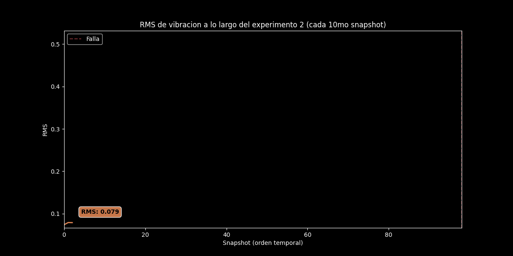
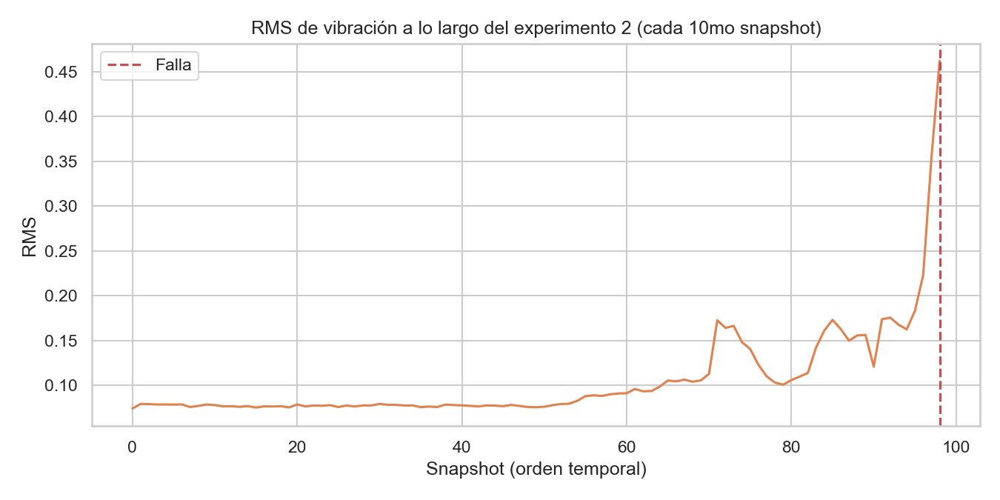
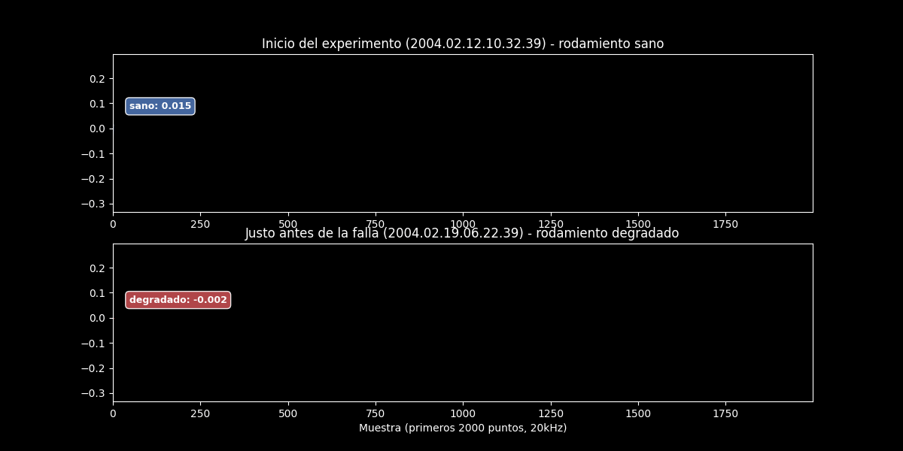
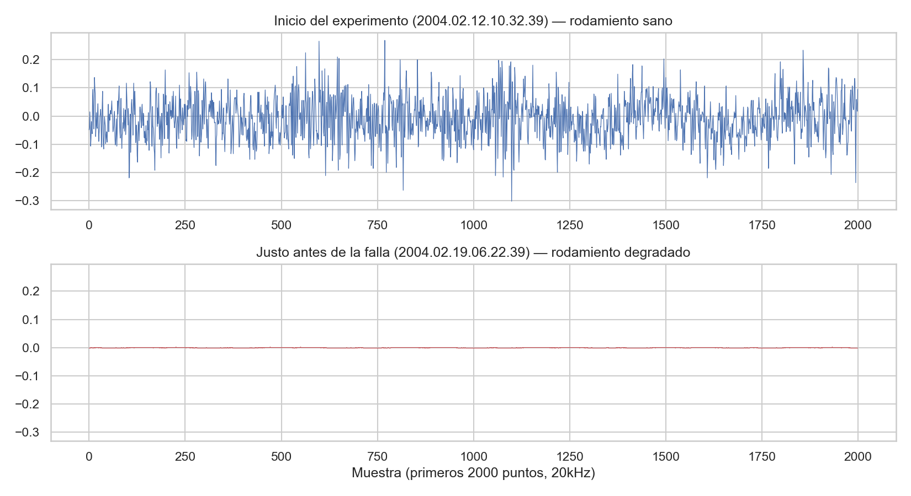
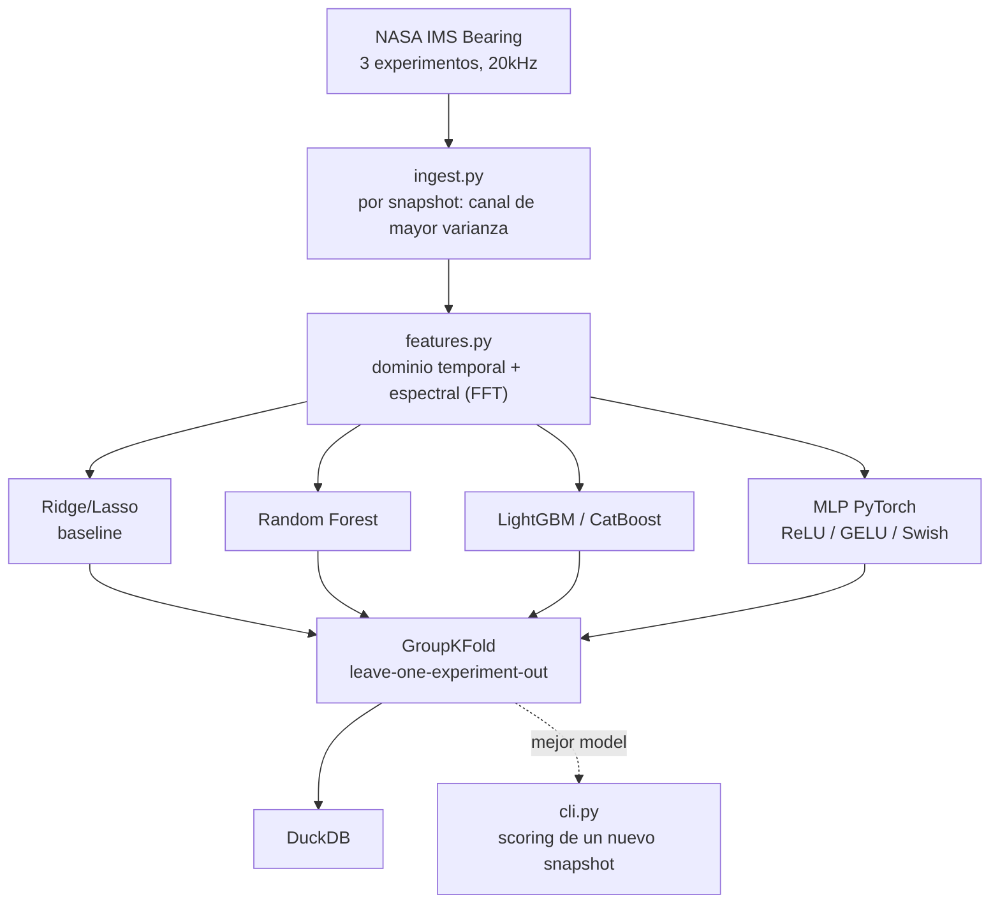

[ 🇺🇸 Read in English ](README.md) | [ 🇨🇱 Español ]

# Prediciendo Fallas de Maquinaria por Sonido

[](https://github.com/Rxyxs/predicting-machine-failure-by-sound/actions/workflows/tests.yml)
[](https://www.python.org/)
[](https://lightgbm.readthedocs.io/)
[](https://scipy.org/)
[](https://duckdb.org/)
[](cpp/fft_features.cpp)
[](LICENSE)

Predice la vida útil restante (RUL) de un rodamiento industrial solo a partir de la señal de vibración cruda — usando el dataset real de NASA/IMS (Center for Intelligent Maintenance Systems, Universidad de Cincinnati) de corridas run-to-failure: 3 bancos de pruebas físicos independientes, muestreo a 20kHz, rodamientos reales llevados hasta la falla mecánica real.

## Datos

[NASA IMS Bearing Dataset](https://data.nasa.gov/dataset/ims-bearings) — 3 experimentos reales (1st/2nd/4th test), snapshots de vibración de 20.480 puntos cada ~10 minutos hasta la falla física. Ninguna señal sintética: cada snapshot es una lectura real de acelerómetro sobre un rodamiento real bajo una carga radial real de 6.000 lb.

## Degradación en el tiempo (EDA)




El GIF dibuja progresivamente la misma tendencia RMS-vs-snapshot del PNG estático de abajo, con una etiqueta que sigue el valor RMS actual hasta el momento de la falla — sin frames sintéticos, solo los datos reales resampleados a ~45 frames.




La misma idea aplicada a la forma de onda cruda: rodamiento sano (arriba) vs. el mismo canal justo antes de la falla (abajo), ambos trazos dibujados progresivamente con una etiqueta de amplitud en vivo.

## Procesamiento de señal → features

Por snapshot: dominio temporal (RMS, crest factor, kurtosis, skew, cuartiles rodantes) + dominio de frecuencia vía FFT (frecuencia dominante, entropía espectral, centroide espectral, energía por banda en 4 bandas relevantes a frecuencias de defecto de rodamiento). El vector de features de cada snapshot se construye con el canal de mayor varianza — un proxy automático y explicable de "el rodamiento más degradado en ese instante", evitando asumir de antemano cuál de los 4 rodamientos por experimento realmente falla.

## Bug real encontrado mirando los números, no asumiendo que el pipeline estaba bien

**Primer intento** (target = minutos crudos hasta la falla): MAE de **miles de minutos** en GroupKFold (leave-one-experiment-out). Causa raíz, encontrada revisando la duración de cada experimento en vez de ajustar a ciegas: los 3 experimentos duran radicalmente distinto (1st_test ≈15 días, 2nd_test ≈7 días, 4th_test ≈44 días) — un modelo entrenado en 2 experimentos nunca vio la escala temporal absoluta del tercero, así que la regresión en minutos crudos no generaliza entre bancos de pruebas físicamente independientes.

**Corrección**: cambiar el target a **RUL fraccional** (`snapshots_restantes / snapshots_totales`, 0→1), el enfoque estándar en la literatura de RUL exactamente por esta razón — invariante a la escala entre corridas de distinta duración. Resultado: el MAE cayó de miles de minutos a **0,216** (21,6% de la vida restante) con CatBoost, una mejora de 3-8x según el modelo, evaluado de la misma forma (3-fold leave-one-experiment-out).

## Arquitectura



## Resultados (corrida real, GroupKFold leave-one-experiment-out, 3 bancos físicos independientes)

| Modelo | Target | MAE (promedio ± std entre 3 folds) |
|---|---|---:|
| Random Forest | minutos (absoluto) | 14.776 ± 8.680 min |
| CatBoost | RUL fraccional [0,1] | 0,216 ± 0,020 |
| Lasso | RUL fraccional [0,1] | 0,240 ± 0,072 |
| LightGBM | RUL fraccional [0,1] | 0,243 ± 0,018 |
| Random Forest | RUL fraccional [0,1] | 0,255 ± 0,053 |
| Ridge | RUL fraccional [0,1] | 0,300 ± 0,089 |
| **CatBoost, afinado con Optuna (30 trials)** | **RUL fraccional [0,1]** | **0,208** |

CatBoost gana también con la menor desviación entre folds — el generalizador más *consistente* entre 3 bancos de rodamientos físicamente distintos, no solo el mejor promedio.

## Ajuste de hiperparámetros (Optuna)

`python -m src.tune` corre una búsqueda Optuna de 30 trials sobre CatBoost (`iterations`, `depth`, `learning_rate`, `l2_leaf_reg`, `bagging_temperature`), minimizando el mismo MAE de GroupKFold leave-one-experiment-out de 3 folds usado en el resto del proyecto — no un esquema de validación distinto y más fácil elegido para que el número se vea mejor. Resultado: MAE 0,2159 → 0,2080, una mejora real pero modesta (~3,7% relativo) — honestamente modesta porque 3 folds de GroupKFold (uno por banco físico) es una señal de validación chica para una búsqueda de hiperparámetros, y eso se divulga en vez de presentarse como una victoria mayor de lo que es.

## Tercer enfoque de modelado: MLP en PyTorch, comparación de activaciones

`python -m src.dl_pipeline` agrega un MLP chico (`src/dl_model.py`, 2 capas ocultas + dropout, salida sigmoid para RUL fraccional) entrenado con una **loss custom de MAE ponderado** que penaliza más el error cerca del fin de vida útil (`peso = 1 + 2*(1 - target)`) — una predicción errada en RUL≈0 es más costosa en mantenimiento predictivo real que el mismo error absoluto en RUL≈0,9. Evaluado con exactamente el mismo protocolo que el resto del proyecto: 3-fold GroupKFold leave-one-experiment-out, mismas features, mismo target `rul_fraction`, para que los números sean directamente comparables.

| Activación | MAE (promedio ± std entre 3 folds) |
|---|---:|
| **GELU** | **0,296 ± 0,011** |
| ReLU | 0,321 ± 0,052 |
| Swish (SiLU) | 0,326 ± 0,031 |

GELU tiene el MAE más bajo y también, por lejos, la menor desviación estándar — la activación más consistente entre los 3 bancos físicamente independientes. Divulgación honesta: los ensambles de árboles siguen ganando en general (CatBoost 0,208 vs. MLP-GELU 0,296) — con ~3.150 snapshots y solo 3 grupos de validación, gradient boosting sobre features espectrales manuales generaliza mejor aquí que un MLP entrenado desde cero, un resultado legítimo y común en datasets tabulares chicos de features de señal.

Las métricas quedan en `outputs/bearing.duckdb` (tabla `dl_metrics`, aditiva a `model_metrics`) y en `outputs/reports/dl_activation_comparison.{csv,json,png}`.

## Hot-path en tiempo real en C++: FFT hecha a mano, cero dependencias

`features.py` en Python usa la FFT de SciPy — la herramienta correcta para investigación offline, pero no algo que un dispositivo embebido de monitoreo de vibración (el destino de despliegue real de este tipo de sistema) pueda correr. `cpp/fft_features.cpp` reimplementa el hot-path de procesamiento de señal desde cero: una FFT radix-2 Cooley-Tukey (in-place, iterativa, sin ninguna librería externa — mismo estilo cero-dependencias de los otros repos de sistemas en C++ de este portafolio) más RMS, kurtosis, frecuencia dominante, entropía espectral y energía por banda, con las mismas fórmulas que usa `features.py`.

**Nota honesta de alcance**: una FFT radix-2 requiere una longitud potencia de 2, así que ambos lados de la comparación truncan cada snapshot de 20.480 puntos a sus primeros **16.384 puntos (2¹⁴)**, de forma idéntica — no se comparan transformadas de distinta longitud. Verificado contra Python sobre 5 snapshots reales (que abarcan todo el rango sano→fallado del experimento 2): **diferencia absoluta máxima 5,9×10⁻⁸** en las 5 features (RMS, kurtosis, frecuencia dominante, entropía espectral, energía de banda) — efectivamente bit-exacto dado el round-trip de I/O por archivo de texto. Benchmark: **1.082 snapshots/segundo**, 924μs por snapshot (FFT de 16.384 puntos + extracción completa de features) — este experimento solo *necesita* un snapshot cada 10 minutos, así que el hot-path tiene aproximadamente 5 órdenes de magnitud de margen sobre el requerimiento real de tiempo real.

```powershell
python -m src.export_for_cpp   # regenera cpp/snapshot_*.txt + python_reference.csv
cd cpp
cl /EHsc /O2 /std:c++17 fft_features.cpp /Fe:fft_features.exe   # o g++ -O3 -std=c++17
.\fft_features.exe
```

## Uso

```powershell
python -m venv venv
venv\Scripts\activate
pip install -r requirements.txt
pip install torch --index-url https://download.pytorch.org/whl/cpu  # wheel CPU, descarga mas chica
python -m src.pipeline                          # pipeline completo: baselines + arboles, datos reales
python -m src.dl_pipeline                        # MLP PyTorch, comparacion ReLU/GELU/Swish
pytest tests/ -q                                 # 10/10 passing
python -m src.cli --file ruta\al\snapshot.txt    # scoring de un snapshot real
```

## Stack

NumPy/SciPy (FFT, estadística) · pandas · scikit-learn (Ridge/Lasso/Random Forest, GroupKFold) · LightGBM · CatBoost · PyTorch · DuckDB · pytest · **C++** (FFT radix-2 hecha a mano, cero dependencias, hot-path en tiempo real)

## Autor

**Pablo Reyes** — [github.com/Rxyxs](https://github.com/Rxyxs)

Datos: [NASA Open Data Portal — IMS Bearings](https://data.nasa.gov/dataset/ims-bearings), Center for Intelligent Maintenance Systems, Universidad de Cincinnati. Código: MIT — ver [LICENSE](LICENSE).
