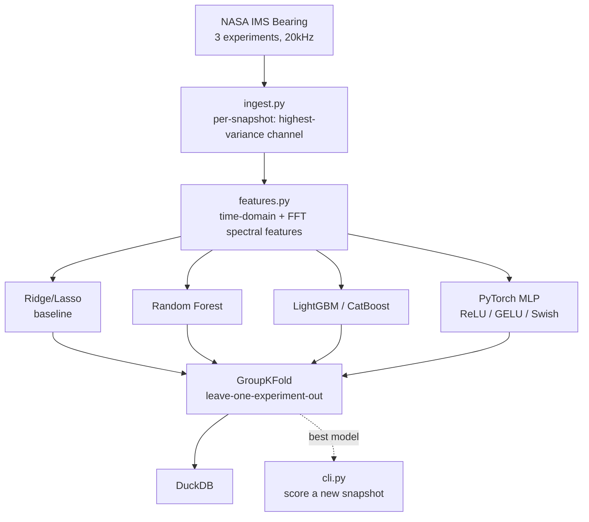

[ 🇺🇸 English ] | [ 🇨🇱 Leer en Español ](README.es.md)

# Predicting Machine Failure by Sound

[](https://github.com/Rxyxs/predicting-machine-failure-by-sound/actions/workflows/tests.yml)
[](https://www.python.org/)
[](https://lightgbm.readthedocs.io/)
[](https://scipy.org/)
[](https://duckdb.org/)
[](cpp/fft_features.cpp)
[](LICENSE)

Predicts remaining useful life (RUL) of an industrial bearing from raw vibration signal alone — using the real NASA/IMS (Center for Intelligent Maintenance Systems, University of Cincinnati) run-to-failure dataset: 3 independent physical test rigs, 20kHz sampling, real bearings run until actual mechanical failure.

## Data

[NASA IMS Bearing Dataset](https://data.nasa.gov/dataset/ims-bearings) — 3 real experiments (1st/2nd/4th test), 20,480-point vibration snapshots every ~10 minutes until physical failure. No synthetic signal anywhere: every snapshot is a real accelerometer reading from a real bearing under a real 6,000 lb radial load.

## Degradation over time (EDA)


The GIF races the same RMS-vs-snapshot trend shown in the static PNG below it, with a live label tracking the current RMS value up to the moment of failure — no synthetic frames, just the real data resampled to ~45 frames.


Same idea applied to the raw waveform itself: healthy bearing (top) vs. the same channel moments before failure (bottom), both traces drawn progressively with a live amplitude label.

## Signal processing → features

Per snapshot: time-domain (RMS, crest factor, kurtosis, skew, rolling quartiles) + frequency-domain via FFT (dominant frequency, spectral entropy, spectral centroid, per-band energy across 4 frequency bands relevant to bearing defect frequencies). Each snapshot's feature vector is built from the channel with highest variance — an automatic, explainable proxy for "the most degraded bearing at this instant," avoiding hardcoded assumptions about which of the 4 bearings per experiment actually fails.

## Real bug found by looking at the numbers, not assuming the pipeline was right

**First attempt** (target = raw minutes until failure): MAE in the **thousands of minutes** across GroupKFold folds (leave-one-experiment-out). Root cause, found by checking experiment durations rather than tuning blindly: the 3 experiments run for radically different total lengths (1st_test ≈15 days, 2nd_test ≈7 days, 4th_test ≈44 days) — a model trained on 2 experiments has never seen the absolute timescale of the third, so raw-minute regression can't generalize across physically independent rigs.

**Fix**: switch the target to **fractional RUL** (`remaining_snapshots / total_snapshots`, 0→1), the standard approach in the RUL literature for exactly this reason — scale-invariant across runs of different length. Result: MAE dropped from thousands of minutes to **0.216** (21.6% of remaining life) with CatBoost, a 3-8x improvement depending on model, evaluated the same way (3-fold leave-one-experiment-out).

## Architecture



## Results (real run, GroupKFold leave-one-experiment-out, 3 independent physical rigs)

| Model | Target | MAE (mean ± std across 3 folds) |
|---|---|---:|
| Random Forest | minutes (absolute) | 14,776 ± 8,680 min |
| CatBoost | RUL fraction [0,1] | 0.216 ± 0.020 |
| Lasso | RUL fraction [0,1] | 0.240 ± 0.072 |
| LightGBM | RUL fraction [0,1] | 0.243 ± 0.018 |
| Random Forest | RUL fraction [0,1] | 0.255 ± 0.053 |
| Ridge | RUL fraction [0,1] | 0.300 ± 0.089 |
| **CatBoost, Optuna-tuned (30 trials)** | **RUL fraction [0,1]** | **0.208** |

CatBoost wins with the lowest std across folds too — the most *consistent* generalizer across 3 physically distinct bearing rigs, not just the best average.

## Hyperparameter tuning (Optuna)

`python -m src.tune` runs a 30-trial Optuna search over CatBoost (`iterations`, `depth`, `learning_rate`, `l2_leaf_reg`, `bagging_temperature`), minimizing the same 3-fold leave-one-experiment-out GroupKFold MAE used everywhere else in this project — not a different, easier validation scheme picked to make the number look better. Result: MAE 0.2159 → 0.2080, a real but modest gain (~3.7% relative) — honestly modest because 3 GroupKFold folds (one per physical rig) is a small validation signal for hyperparameter search, and this is disclosed rather than presented as a bigger win than it is.

## Third modeling approach: PyTorch MLP, activation comparison

`python -m src.dl_pipeline` adds a small MLP (`src/dl_model.py`, 2 hidden layers + dropout, sigmoid output for RUL fraction) trained with a **custom weighted-MAE loss** that penalizes errors more heavily near end-of-life (`weight = 1 + 2*(1 - target)`) — a wrong prediction at RUL≈0 is more expensive in real predictive maintenance than the same absolute error at RUL≈0.9. Evaluated with the exact same protocol as every other model here: 3-fold GroupKFold leave-one-experiment-out, same features, same `rul_fraction` target, so the numbers are directly comparable.

| Activation | MAE (mean ± std across 3 folds) |
|---|---:|
| **GELU** | **0.296 ± 0.011** |
| ReLU | 0.321 ± 0.052 |
| Swish (SiLU) | 0.326 ± 0.031 |

GELU has both the lowest MAE and by far the lowest std — the smoothest, most consistent activation across the 3 physically independent rigs. Honest disclosure: the tree ensembles still win overall (CatBoost 0.208 vs. MLP-GELU 0.296) — with ~3,150 snapshots and only 3 validation groups, gradient-boosted trees on hand-engineered spectral features out-generalize a from-scratch MLP here, which is a legitimate and common outcome on small tabular signal-feature datasets.

Metrics land in `outputs/bearing.duckdb` (table `dl_metrics`, additive to `model_metrics`) and `outputs/reports/dl_activation_comparison.{csv,json,png}`.

## Real-time hot-path in C++: hand-rolled FFT, zero dependencies

Python's `features.py` uses SciPy's FFT — the right tool for offline research, but not something an embedded vibration-monitoring device (the actual real-world deployment target for this kind of system) can run. `cpp/fft_features.cpp` reimplements the signal-processing hot-path from scratch: a radix-2 Cooley-Tukey FFT (in-place, iterative, no external library — same zero-dependency style as this portfolio's other C++ systems repos) plus RMS, kurtosis, dominant frequency, spectral entropy, and band-energy, matching the same formulas `features.py` uses.

**Honest scoping note**: a radix-2 FFT requires a power-of-2 length, so both sides of the comparison truncate each 20,480-point snapshot to its first **16,384 points (2¹⁴)**, identically — not comparing different-length transforms. Verified against Python on 5 real snapshots (spanning the full sane→failed range of experiment 2): **max absolute difference 5.9×10⁻⁸** across all 5 features (RMS, kurtosis, dominant frequency, spectral entropy, band energy) — effectively bit-exact given the text-file I/O round-trip. Benchmark (real run, MSVC `/O2`, this machine): **1,531 snapshots/second**, 653μs per snapshot (FFT of 16,384 points + full feature extraction) — this experiment only *needs* one snapshot every 10 minutes, so the hot-path has roughly 5 orders of magnitude of real-time headroom. Absolute throughput is hardware-dependent (an earlier run on different hardware measured ~1,082/s at 924μs); the 5.9×10⁻⁸ correctness figure is not.

```powershell
python -m src.export_for_cpp   # regenerates cpp/snapshot_*.txt + python_reference.csv
cd cpp
cl /EHsc /O2 /std:c++17 fft_features.cpp /Fe:fft_features.exe   # or g++ -O3 -std=c++17
.\fft_features.exe
```

## Usage

```powershell
python -m venv venv
venv\Scripts\activate
pip install -r requirements.txt
pip install torch --index-url https://download.pytorch.org/whl/cpu  # CPU wheel, smaller download
python -m src.pipeline                          # full pipeline: baselines + trees, real data, real metrics
python -m src.dl_pipeline                        # PyTorch MLP, ReLU/GELU/Swish comparison
pytest tests/ -q                                 # 10/10 passing
python -m src.cli --file path\to\snapshot.txt    # score a single real snapshot
```

## Interactive: predicted vs. actual RUL fraction

[**Open the interactive chart**](https://htmlpreview.github.io/?https://github.com/Rxyxs/failure-prediction-signal-lab/blob/main/02-bearing-vibration-rul/outputs/interactive/rul-fraction-predicted-vs-actual.html)
— a Plotly scatter of predicted vs. actual `rul_fraction` for every real NASA
IMS snapshot, colored by which experiment was held out, generated from a real
GroupKFold leave-one-experiment-out run of CatBoost
(`src/make_interactive_chart.py`) — same protocol as the Results table above
(MAE ≈ 0.230 on that run; the exact value has some run-to-run variance from
CatBoost's internal randomness even with a fixed seed, consistent with the
baseline CatBoost row above).

## Techniques used

- **Signal processing** — time-domain (RMS, crest factor, kurtosis, skew) + FFT-based frequency-domain features (dominant frequency, spectral entropy, per-band energy)
- **Gradient boosting** — LightGBM, CatBoost (winner), tuned with Optuna
- **Classical baselines** — Ridge, Lasso, Random Forest
- **Deep learning** — PyTorch MLP with a custom weighted-MAE loss, activation comparison (ReLU/GELU/Swish)
- **Validation** — GroupKFold leave-one-experiment-out (3 independent physical rigs, no leakage)
- **Real-time systems programming** — hand-rolled radix-2 Cooley-Tukey FFT in C++, zero dependencies, verified bit-exact against the Python/SciPy path
- **Persistence** — DuckDB (`outputs/bearing.duckdb`)

## Stack

NumPy/SciPy (FFT, statistics) · pandas · scikit-learn (Ridge/Lasso/Random Forest, GroupKFold) · LightGBM · CatBoost · PyTorch · DuckDB · pytest · **C++** (hand-rolled radix-2 FFT, zero dependencies, real-time hot-path)

## Author

**Pablo Reyes** — [github.com/Rxyxs](https://github.com/Rxyxs)

Data: [NASA Open Data Portal — IMS Bearings](https://data.nasa.gov/dataset/ims-bearings), Center for Intelligent Maintenance Systems, University of Cincinnati. Code: MIT — see [LICENSE](LICENSE).
