<div align="center">

# LANL Earthquake Signal Prediction

**Sistema de machine learning de punta a punta para predecir `time_to_failure` a partir de senales acusticas sismicas**


[English](README.md)

</div>

## Descripcion general

Este proyecto implementa un pipeline completo y reproducible de machine learning inspirado en la
competencia de Kaggle **LANL Earthquake Prediction**, cuyo objetivo es estimar `time_to_failure`
— el tiempo restante hasta el proximo sismo de laboratorio — a partir de una senal continua de
emision acustica.

Dado que el dataset original de la competencia pesa varios gigabytes y requiere una cuenta de
Kaggle, el proyecto incluye un **generador sintetico de senales de alta fidelidad** que reproduce
la firma estadistica de los datos reales (ruido de fondo, pulsos precursores crecientes y eventos
de falla abruptos), de forma que todo el pipeline corre de inmediato con `python -m src.pipeline`.
Si existen credenciales de Kaggle (`~/.kaggle/kaggle.json` o `KAGGLE_USERNAME`/`KAGGLE_KEY`), el
proyecto puede intentar opcionalmente descargar el dataset real de la competencia.

## Arquitectura

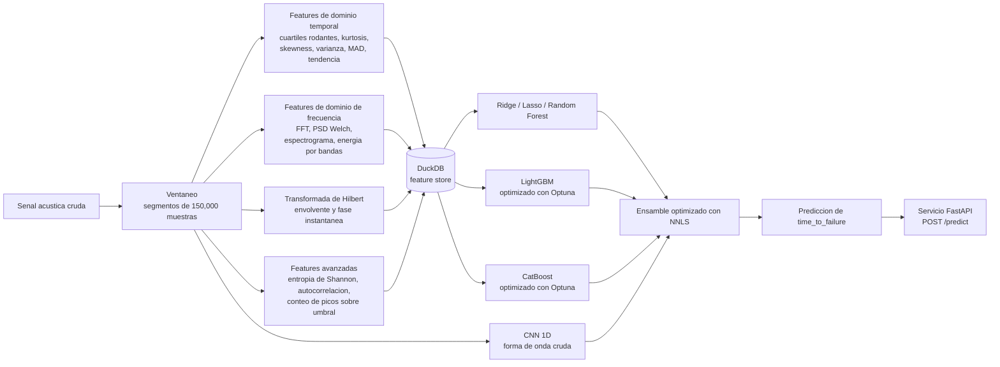

## Desarrollo tecnico

Mas alla del pipeline base, se profundizo en tres frentes:

- **Features avanzadas de senal** (`src/features/advanced_features.py`): entropia de Shannon de
  la distribucion de amplitudes y del signo de la primera diferencia, autocorrelacion en
  multiples lags (1, 5, 10, 50, 100 muestras), y conteo de picos por encima de 2/4/6/8
  desviaciones estandar mas su distancia media de recurrencia. Estas features apuntan a la
  estructura no lineal e impulsiva de los micro-eventos precursores, que los momentos estadisticos
  simples (media, std, kurtosis) tienden a diluir.
- **Optimizacion real de hiperparametros** (`src/models/tuning.py`): LightGBM y CatBoost se
  optimizan con **Optuna** (sampler TPE, 15 trials cada uno por defecto), minimizando el mismo MAE
  out-of-fold usado en el resto del pipeline, de forma que el objetivo de tuning coincide
  exactamente con el objetivo de evaluacion. Los mejores parametros encontrados se persisten en
  `reports/training_report.json` bajo `tuned_hyperparameters` y se reutilizan en el entrenamiento
  final.
- **Ensamble optimizado** (`src/models/ensemble.py`): en vez de pesos fijos por inverso del MAE,
  el ensamble ahora resuelve un problema de minimos cuadrados no negativos
  (`scipy.optimize.nnls`) directamente sobre las predicciones out-of-fold, permitiendo que los
  pesos se adapten a cuanta senal marginal aporta realmente cada modelo (en la corrida actual esto
  lleva a Lasso, Random Forest y la CNN a un peso practicamente nulo, concentrando el ensamble en
  CatBoost/LightGBM/Ridge).
- **Experimento de activaciones** (`src/models/activation_experiment.py`): una variante de la CNN
  1D (`CNN1DActivation`) parametrizada por funcion de activacion (ReLU, GELU, Swish/SiLU),
  entrenada con una `WeightedHuberLoss` a medida que combina la robustez a outliers de la Huber
  loss con pesos por muestra que crecen exponencialmente a medida que `time_to_failure` se acerca
  a cero, penalizando mas los errores justo antes de un evento de falla que en zonas de calma de
  la senal.

## Graficos

Todos los graficos siguientes se generan con `python -m scripts.generate_figures` a partir de
artefactos reales del pipeline (sin placeholders) y se guardan en `reports/figures/`.

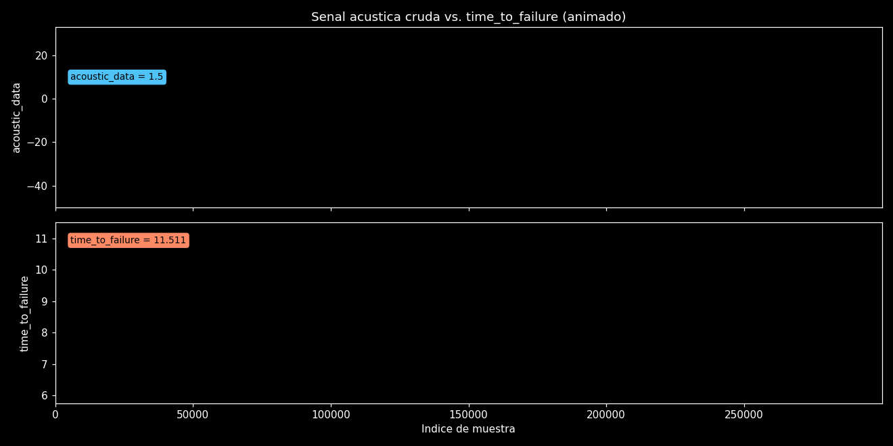
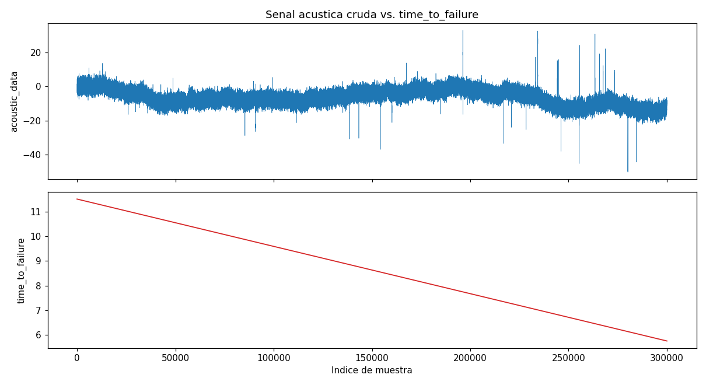

La version animada dibuja la senal progresivamente sobre el mismo eje temporal, con una etiqueta
flotante que sigue los valores actuales de `acoustic_data` y `time_to_failure` a medida que avanza.

Senal acustica cruda (arriba) contra `time_to_failure` (abajo) sobre un eje temporal compartido.
La caida abrupta a cero marca un evento de falla simulado; el crecimiento de amplitud de la senal
justo antes es el patron precursor que los modelos deben aprender a detectar.

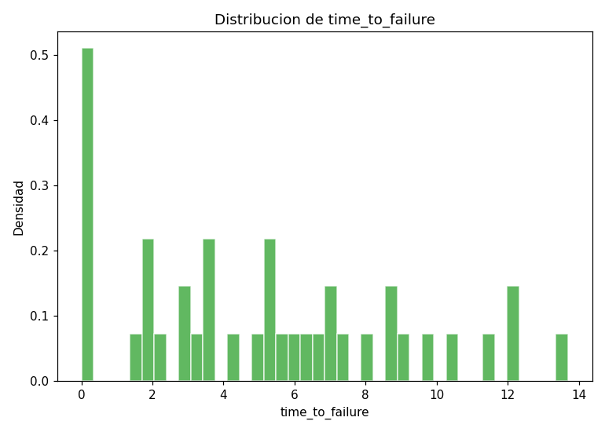

Distribucion de `time_to_failure` a lo largo de todos los segmentos extraidos. El generador
sintetico produce ciclos de duracion variable (8-16 unidades de tiempo), por lo que el histograma
no es perfectamente uniforme.

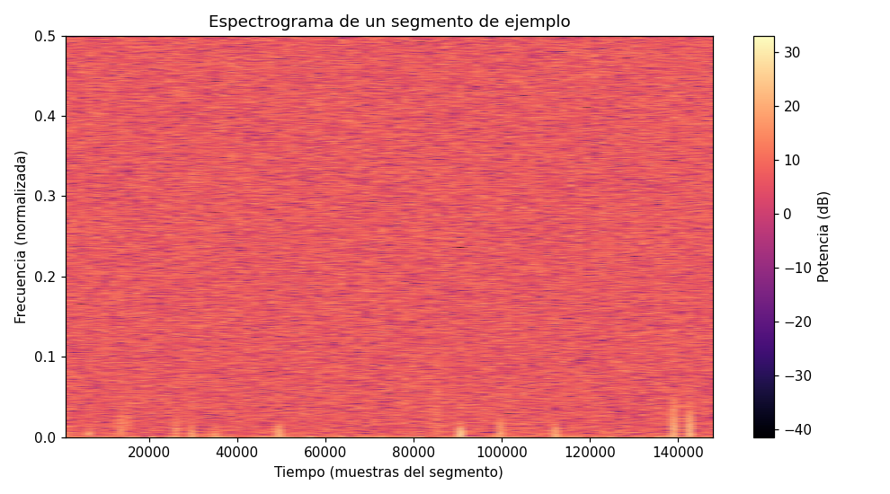

Espectrograma de un segmento de 150,000 muestras. Las bandas verticales brillantes corresponden a
ráfagas cortas de alta energia (pulsos precursores); es la contraparte visual de las features
`spec_*` y `psd_band_*`.

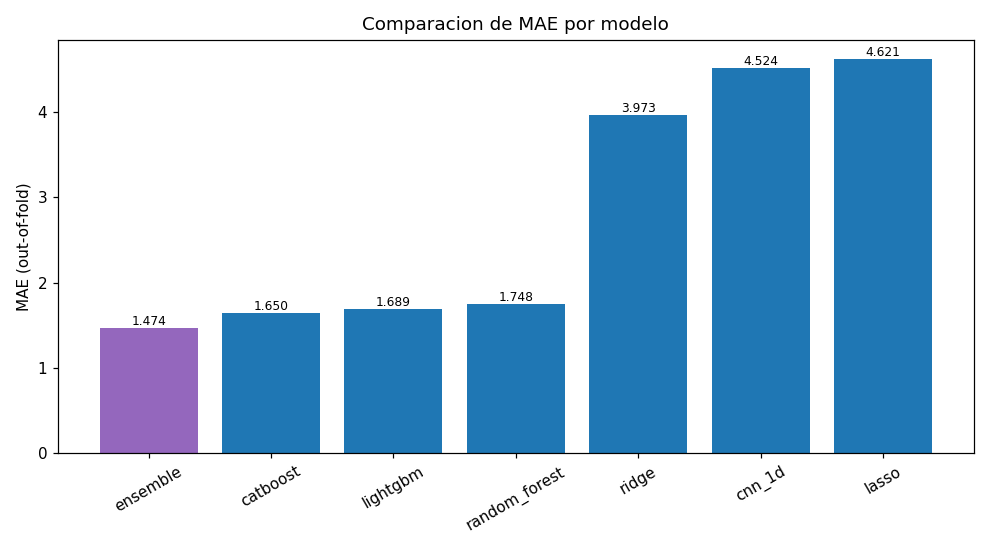

MAE out-of-fold de cada modelo del pipeline. El ensamble optimizado con NNLS supera a todos los
modelos individuales en esta corrida.

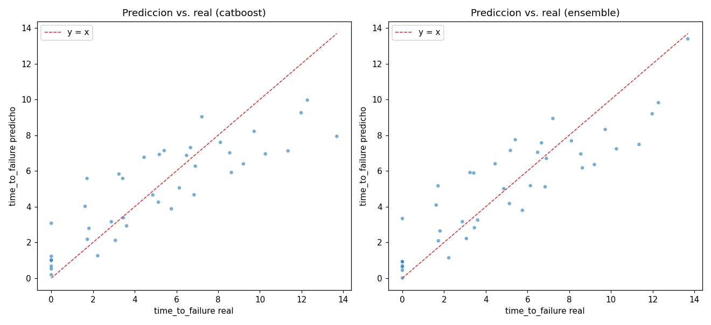

Prediccion vs. valor real de `time_to_failure` sobre datos de validacion out-of-fold, para el
mejor modelo individual y para el ensamble; los puntos mas cercanos a la diagonal son mejores
predicciones.

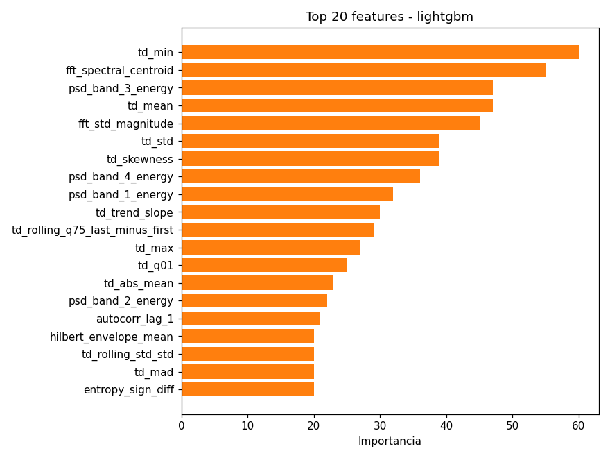
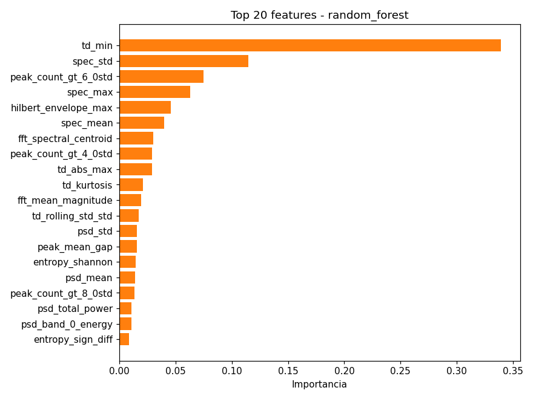

Top-20 features mas importantes para el LightGBM optimizado con Optuna y para el Random Forest.
Las estadisticas de ventanas rodantes, la entropia y el conteo de picos aparecen consistentemente
entre las mas informativas, confirmando el valor de los descriptores no lineales agregados.

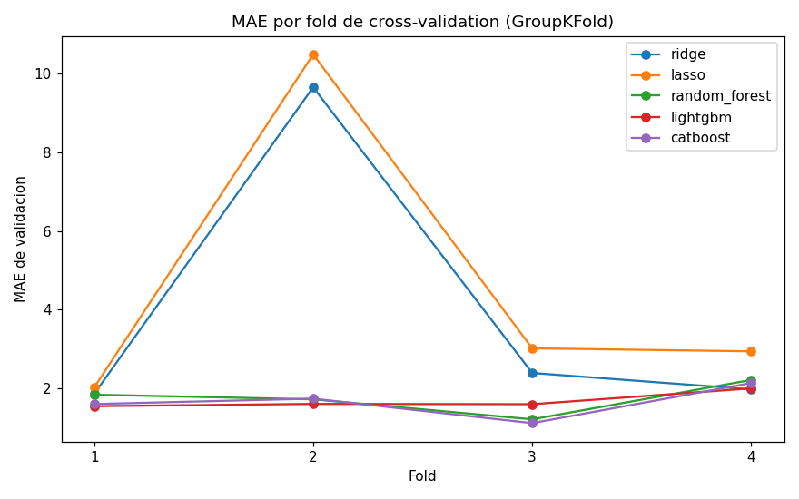

MAE por fold a lo largo de la validacion cruzada GroupKFold para cada modelo tabular, mostrando
que tan estable (o sensible al fold) es cada modelo entre distintos grupos temporales de la senal
sintetica.

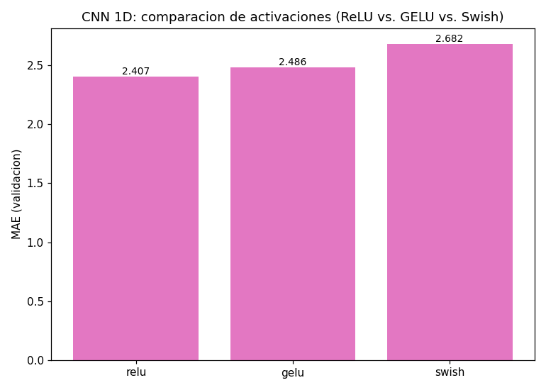
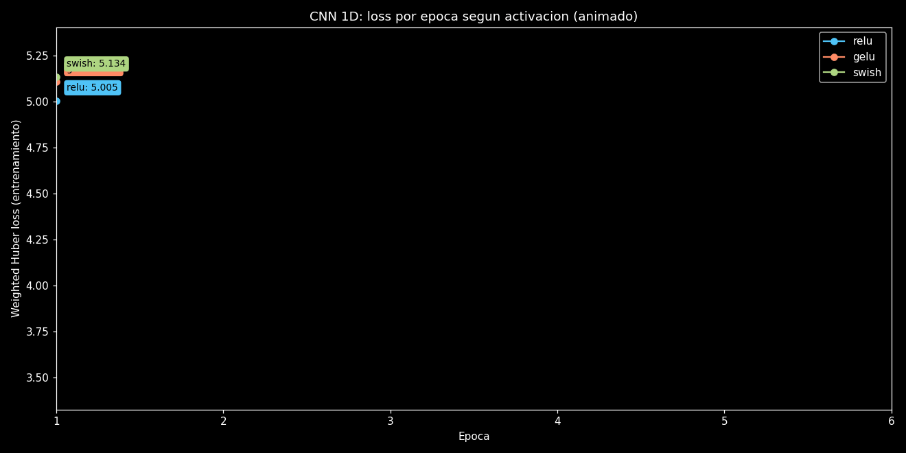
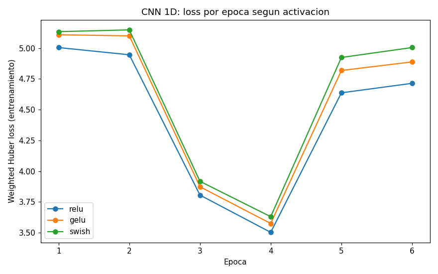

La version animada hace avanzar la curva de loss real de cada activacion a lo largo de las epocas,
mostrando una etiqueta con el valor actual de loss en la punta de cada linea.

Comparacion de funciones de activacion (ReLU, GELU, Swish/SiLU) para la CNN 1D, todas entrenadas
con la misma `WeightedHuberLoss` custom (`src/models/activation_experiment.py`), que aumenta el
peso de los errores en segmentos cercanos a la falla (`time_to_failure` bajo), donde la precision
importa mas para un sistema de alerta temprana. Se genera con
`python -m scripts.run_activation_experiment`, que tambien persiste los resultados en
`reports/activation_experiment.json` y en la tabla `activation_experiment` de
`data/processed/features.duckdb`.

## Resultados

Benchmark obtenido al ejecutar `python -m src.pipeline` sobre el **dataset sintetico de
demostracion** (40 segmentos, GroupKFold con 4 folds, MAE out-of-fold, LightGBM/CatBoost
optimizados con Optuna, pesos del ensamble optimizados via NNLS). Estos numeros son ilustrativos
de la mecanica del pipeline, no una afirmacion de desempeno sobre el dataset real de Kaggle.

| Modelo                        | MAE (out-of-fold) |
|-------------------------------|--------------------|
| **Ensamble ponderado (NNLS)** | **1.4739**         |
| CatBoost (optimizado)         | 1.6497             |
| LightGBM (optimizado)         | 1.6891             |
| Random Forest                 | 1.7483             |
| Ridge                         | 3.9732             |
| CNN 1D (forma de onda cruda)  | 4.5085             |
| Lasso                         | 4.6207             |

Los resultados completos se guardan en `reports/mae_report.csv` y `reports/training_report.json`
tras cada ejecucion del pipeline, incluyendo el MAE por fold y los hiperparametros seleccionados
por Optuna.

### Comparacion de activaciones (CNN 1D, loss Huber ponderada)

Mismo dataset sintetico, `python -m scripts.run_activation_experiment` (18 segmentos de
entrenamiento / 6 de validacion, 6 epocas, `WeightedHuberLoss`):

| Activacion    | MAE de validacion |
|---------------|--------------------|
| **ReLU**      | **2.4066**         |
| GELU          | 2.4856             |
| Swish (SiLU)  | 2.6823             |

Las metricas completas (incluyendo la loss de entrenamiento por epoca) se guardan en
`reports/activation_experiment.json` y en la tabla `activation_experiment` de
`data/processed/features.duckdb`.

## Interactivo: time_to_failure predicho vs. real

[**Abrir el gráfico interactivo**](https://htmlpreview.github.io/?https://github.com/Rxyxs/failure-prediction-signal-lab/blob/main/03-earthquake-acoustic-signal/outputs/interactive/ttf-predicted-vs-actual.html)
— un scatter Plotly de `time_to_failure` predicho vs. real, una traza por
modelo, activable/desactivable desde la leyenda, construido directamente a
partir de las predicciones out-of-fold reales (`reports/oof_predictions.npz`)
generadas por la corrida `--n-splits 4` de arriba — el mismo arreglo del que
sale `reports/figures/prediction_vs_actual.png`, solo que interactivo.

## Técnicas utilizadas

- **Feature engineering de señal** — estadísticas rodantes en el dominio temporal, PSD FFT/Welch, energía por banda del espectrograma, envolvente/fase vía transformada de Hilbert, entropía de Shannon, autocorrelación, conteo de picos sobre umbral
- **Gradient boosting** — LightGBM y CatBoost, ambos optimizados con Optuna (sampler TPE)
- **Baselines clásicos** — Ridge, Lasso, Random Forest
- **Deep learning** — CNN 1D sobre la forma de onda cruda, más una ablación de función de activación (ReLU/GELU/Swish) con loss Huber ponderada custom
- **Ensamble** — ensamble ponderado optimizado con NNLS sobre predicciones out-of-fold
- **Validación** — GroupKFold sobre segmentos temporales
- **Almacenamiento y servicio** — feature store en DuckDB, servicio de predicción FastAPI, CLI con Typer

## Estructura del proyecto

```
src/
  data/        generador de senales sinteticas + ingesta opcional de Kaggle
  features/    ventaneo, extraccion de features tiempo/frecuencia/Hilbert/avanzadas, almacenamiento DuckDB
  models/      validacion cruzada GroupKFold, baselines, LightGBM, CatBoost, CNN 1D, tuning Optuna, ensamble
  viz/         funciones de graficacion matplotlib usadas para generar reports/figures/*.png
  api/         servicio FastAPI (POST /predict, GET /health)
  cli.py       CLI con Typer: generate-data, extract-features, train, score-batch
  pipeline.py  orquestador end-to-end (python -m src.pipeline)
scripts/
  generate_figures.py  regenera cada grafico en reports/figures/ a partir de artefactos del pipeline
tests/         suite de pytest: features (incl. avanzadas), almacenamiento DuckDB, ensamble/tuning, graficos, API
```

## Inicio rapido

```bash
# 1. Instalar dependencias
python -m venv venv
venv\Scripts\activate        # Windows
pip install -r requirements.txt

# 2. Ejecutar el pipeline completo (datos sinteticos -> features -> entrenamiento -> reportes)
python -m src.pipeline --n-splits 4   # --n-splits 4 reproduce exactamente la tabla de Resultados;
                                       # el default de la CLI (5) es una corrida valida, con numeros distintos

# 3. Correr la suite de pruebas
pytest

# 4. Regenerar los graficos de analisis en reports/figures/
python -m scripts.generate_figures

# 5. Servir el modelo entrenado via API
uvicorn src.api.app:app --reload
```

### Ejemplo de llamada a la API

```bash
curl -X POST http://127.0.0.1:8000/predict \
  -H "Content-Type: application/json" \
  -d '{"signal": [0.1, -0.3, 0.05, ...]}'
```

### Uso de la CLI

```bash
python -m src.cli generate-data --n-segments 40
python -m src.cli extract-features
python -m src.cli train --n-splits 5
python -m src.cli score-batch ruta/al/segmento.csv
```

## Conclusion

En esta corrida, el **ensamble optimizado con NNLS** (MAE 1.4739) supero a todos los modelos
individuales, con **CatBoost** (1.6497) y **LightGBM** (1.6891), ambos optimizados con Optuna,
como los aprendices individuales mas fuertes. El patron es consistente con lo esperable para este
tipo de problema: el gradient boosting sobre features tabulares disenadas a mano (estadisticas
rodantes, energia espectral, entropia, autocorrelacion, conteo de picos) captura la estructura
precursora de forma mucho mas eficiente que un modelo lineal (Ridge/Lasso se estancan alrededor de
MAE 4, ya que la relacion entre las estadisticas de la senal cruda y `time_to_failure` es
fuertemente no lineal), y de forma mas eficiente que la CNN 1D con la cantidad de datos disponible
aqui (MAE 4.5) — una red convolucional pequena necesita muchos mas ciclos etiquetados que los 40
segmentos sinteticos usados para aprender una representacion util directamente de la forma de onda
cruda, en vez de sobreajustarse al ruido. La optimizacion importo en la practica, no solo de forma
cosmetica: el solver NNLS del ensamble asigno un peso practicamente nulo a Lasso, Random Forest y
la CNN en este dataset, concentrando casi todo el peso en CatBoost, LightGBM y una pequena
correccion de Ridge — exactamente el tipo de decision que una heuristica fija de inverso-MAE no
habria tomado de forma tan limpia.

**Limitaciones.** Los numeros de cabecera de arriba provienen de un generador de senal
**sintetico**, no del dataset real de Kaggle LANL; el generador reproduce la forma cualitativa del
fenomeno (ruido de fondo, precursores crecientes, falla abrupta) pero no su complejidad
estadistica completa, por lo que los valores de MAE absolutos aqui no son comparables con los
puntajes del leaderboard de la competencia real. El dataset tambien es pequeno (40 segmentos,
GroupKFold de 4 folds), lo que favorece a los ensambles de arboles por sobre el deep learning y
hace que la busqueda de Optuna con solo 15 trials sea superficial — con datos reales y mas
computo, ambos deberian escalarse. Finalmente, la CNN opera sobre una version submuestreada
(6,000 puntos) de cada segmento de 150,000 muestras por razones de tiempo de entrenamiento, lo que
descarta detalle temporal fino que una arquitectura de resolucion completa o jerarquica podria
aprovechar.

**Trabajo futuro.** (1) Reemplazar el generador sintetico por el dataset real de Kaggle LANL
Earthquake Prediction (ya contemplado via `maybe_download_real_dataset`) y correr el mismo
pipeline de punta a punta para obtener un benchmark real comparable con el leaderboard. (2)
Agregar features basadas en wavelets (por ejemplo, energia por escala de la transformada wavelet
discreta) que complementen los descriptores actuales de FFT/Welch/Hilbert, mejor adaptados a
senales estacionarias que a las rafagas transitorias y multi-escala observadas aqui. (3)
Reemplazar la CNN 1D compacta por una arquitectura mas profunda que consuma la forma de onda
completa (por ejemplo, convoluciones causales dilatadas o un transformer pequeno sobre parches del
espectrograma) junto con suficientes datos reales que justifiquen su uso, en vez de una entrada
submuestreada entrenada sobre un puñado de segmentos.

## Licencia

Licencia MIT, Copyright (c) 2026 Pablo Reyes. Ver [LICENSE](LICENSE).
