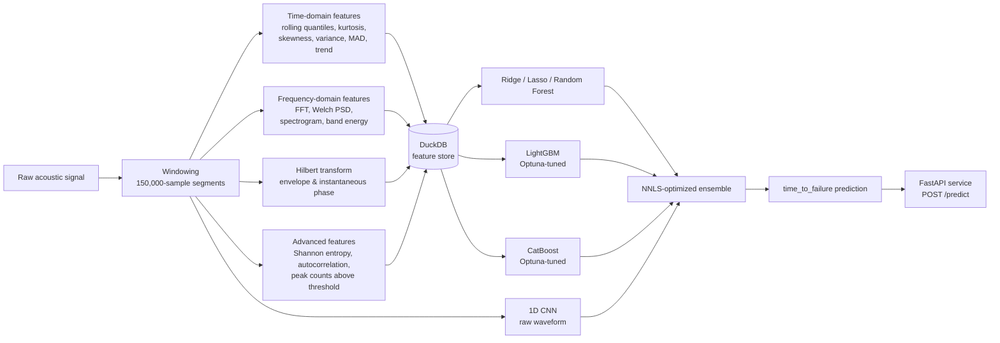

<div align="center">

# LANL Earthquake Signal Prediction

**End-to-end machine learning system for predicting `time_to_failure` from acoustic seismic signals**


[Español](README.es.md)

</div>

## Overview

This project implements a full, reproducible machine learning pipeline inspired by the Kaggle
**LANL Earthquake Prediction** competition, whose goal is to estimate `time_to_failure` — the time
remaining until the next laboratory earthquake — from a continuous acoustic emission signal.

Because the original competition dataset is several gigabytes and requires a Kaggle account, the
project ships with a **high-fidelity synthetic signal generator** that reproduces the statistical
signature of the real data (background noise, growing precursor pulses, and abrupt failure events),
so the entire pipeline runs out of the box with `python -m src.pipeline`. If Kaggle credentials are
present (`~/.kaggle/kaggle.json` or `KAGGLE_USERNAME`/`KAGGLE_KEY`), the project can optionally
attempt to download the real competition data instead.

## Architecture



## Development notes

Beyond the baseline pipeline, three areas were pushed further:

- **Advanced signal features** (`src/features/advanced_features.py`): Shannon entropy of the
  amplitude distribution and of the sign of the first difference, autocorrelation at multiple
  lags (1, 5, 10, 50, 100 samples), and counts of peaks above 2/4/6/8 standard deviations plus
  their mean recurrence gap. These target the non-linear, impulsive structure of precursor
  micro-seismic events that plain moments (mean, std, kurtosis) tend to average away.
- **Real hyperparameter tuning** (`src/models/tuning.py`): LightGBM and CatBoost are tuned with
  **Optuna** (TPE sampler, 15 trials each by default), optimizing the same out-of-fold MAE used
  everywhere else in the pipeline so the tuning objective matches the evaluation objective exactly.
  The best parameters found are persisted in `reports/training_report.json` under
  `tuned_hyperparameters` and reused for the final model fit.
- **Optimized ensemble** (`src/models/ensemble.py`): instead of fixed inverse-MAE weights, the
  ensemble now solves a non-negative least squares problem (`scipy.optimize.nnls`) directly on the
  out-of-fold predictions, letting the weights adapt to how much marginal signal each model
  actually contributes (in the current run it drives Lasso, Random Forest and the CNN to
  effectively zero weight and concentrates on CatBoost/LightGBM/Ridge).
- **Activation function experiment** (`src/models/activation_experiment.py`): a variant of the 1D
  CNN (`CNN1DActivation`) parameterized by activation function (ReLU, GELU, Swish/SiLU), trained
  with a custom `WeightedHuberLoss` that combines the outlier-robustness of Huber loss with sample
  weights that grow exponentially as `time_to_failure` approaches zero, so the model is penalized
  more for mistakes right before a failure event than in quiet regions of the signal.

## Figures

All figures below are generated by `python -m scripts.generate_figures` from real pipeline
artifacts (no placeholders) and saved to `reports/figures/`.


The animated version draws the signal progressively across the same time axis, with a floating
label tracking the current `acoustic_data` and `time_to_failure` values as the line advances.

Raw acoustic signal (top) against `time_to_failure` (bottom) over a shared time axis. The abrupt
drop to zero marks a simulated failure event; the growing amplitude of the signal just before it
is the precursor pattern the models must learn to pick up on.


Distribution of `time_to_failure` across all extracted segments. The synthetic generator produces
cycles of varying duration (8-16 time units), which is why the histogram is not perfectly uniform.


Spectrogram of one 150,000-sample segment. Bright vertical bands correspond to short, high-energy
bursts (precursor pulses); this is the visual counterpart of the `spec_*` and `psd_band_*`
features.


Out-of-fold MAE for every model in the pipeline. The NNLS-optimized ensemble beats every individual
model on this run.


Predicted vs. true `time_to_failure` on out-of-fold validation data for the best single model and
for the ensemble; points closer to the diagonal are better predictions.


Top-20 feature importances for the Optuna-tuned LightGBM and the Random Forest. Rolling-window
statistics, entropy, and peak-count features consistently rank among the most informative,
confirming the value of the added non-linear descriptors.


Per-fold MAE across the GroupKFold cross-validation for each tabular model, showing how stable
(or fold-sensitive) each model is across different temporal groups of the synthetic signal.


The animated version races each activation's training loss curve across the real epochs, labeling
the current loss value at the tip of each line as it updates.

Comparison of activation functions (ReLU, GELU, Swish/SiLU) for the 1D CNN, all trained with the
same custom **weighted Huber loss** (`src/models/activation_experiment.py`) that up-weights errors
on segments close to failure (low `time_to_failure`), where accuracy matters most for an early-warning
system. Generated by `python -m scripts.run_activation_experiment`, which also persists the results
to `reports/activation_experiment.json` and to the `activation_experiment` table in
`data/processed/features.duckdb`.

## Results

Benchmark obtained by running `python -m src.pipeline` on the **synthetic demonstration dataset**
(40 segments, GroupKFold with 4 folds, out-of-fold MAE, LightGBM/CatBoost tuned with Optuna,
ensemble weights optimized via NNLS). These numbers are illustrative of the pipeline's mechanics,
not a claim about performance on the real Kaggle dataset.

| Model                    | MAE (out-of-fold) |
|--------------------------|--------------------|
| **Weighted ensemble (NNLS)** | **1.4739**     |
| CatBoost (Optuna-tuned)  | 1.6497             |
| LightGBM (Optuna-tuned)  | 1.6891             |
| Random Forest            | 1.7483             |
| Ridge                    | 3.9732             |
| 1D CNN (raw waveform)    | 4.5085             |
| Lasso                    | 4.6207             |

Full results are persisted at `reports/mae_report.csv` and `reports/training_report.json` after
every pipeline run, including the per-fold MAE and the Optuna-selected hyperparameters.

### Activation function comparison (1D CNN, weighted Huber loss)

Same synthetic dataset, `python -m scripts.run_activation_experiment` (18 training / 6 validation
segments, 6 epochs, `WeightedHuberLoss`):

| Activation    | Validation MAE |
|---------------|-----------------|
| **ReLU**      | **2.4066**      |
| GELU          | 2.4856          |
| Swish (SiLU)  | 2.6823          |

Full metrics (including per-epoch training loss) are persisted at `reports/activation_experiment.json`
and in the `activation_experiment` table of `data/processed/features.duckdb`.

## Interactive: predicted vs. actual time_to_failure

[**Open the interactive chart**](https://htmlpreview.github.io/?https://github.com/Rxyxs/failure-prediction-signal-lab/blob/main/03-earthquake-acoustic-signal/outputs/interactive/ttf-predicted-vs-actual.html)
— a Plotly scatter of predicted vs. actual `time_to_failure`, one trace per
model, toggleable via the legend, built directly from the real out-of-fold
predictions (`reports/oof_predictions.npz`) written by the `--n-splits 4` run
above — the same array `reports/figures/prediction_vs_actual.png` is drawn
from, just interactive.

## Techniques used

- **Signal feature engineering** — rolling time-domain statistics, FFT/Welch PSD, spectrogram band energy, Hilbert-transform envelope/phase, Shannon entropy, autocorrelation, threshold peak counts
- **Gradient boosting** — LightGBM and CatBoost, both Optuna-tuned (TPE sampler)
- **Classical baselines** — Ridge, Lasso, Random Forest
- **Deep learning** — 1D CNN over the raw waveform, plus an activation-function ablation (ReLU/GELU/Swish) with a custom weighted Huber loss
- **Ensembling** — NNLS-optimized weighted ensemble over out-of-fold predictions
- **Validation** — GroupKFold over temporal segments
- **Storage & serving** — DuckDB feature store, FastAPI prediction service, Typer CLI

## Project structure

```
src/
  data/        synthetic signal generator + optional Kaggle ingestion
  features/    windowing, time/frequency/Hilbert/advanced feature extraction, DuckDB storage
  models/      GroupKFold CV, baselines, LightGBM, CatBoost, 1D CNN, Optuna tuning, ensemble
  viz/         matplotlib plotting functions used to produce reports/figures/*.png
  api/         FastAPI service (POST /predict, GET /health)
  cli.py       Typer CLI: generate-data, extract-features, train, score-batch
  pipeline.py  end-to-end orchestrator (python -m src.pipeline)
scripts/
  generate_figures.py  regenerates every figure in reports/figures/ from pipeline artifacts
tests/         pytest suite: features (incl. advanced), DuckDB storage, ensemble/tuning, plots, API
```

## Quickstart

```bash
# 1. Install dependencies
python -m venv venv
venv\Scripts\activate        # Windows
pip install -r requirements.txt

# 2. Run the full pipeline (synthetic data -> features -> training -> reports)
python -m src.pipeline --n-splits 4   # --n-splits 4 reproduces the Results table below exactly;
                                       # the CLI default (5) is a valid, slightly different run

# 3. Run the test suite
pytest

# 4. Regenerate the analysis figures in reports/figures/
python -m scripts.generate_figures

# 5. Serve the trained model via API
uvicorn src.api.app:app --reload
```

### Example API call

```bash
curl -X POST http://127.0.0.1:8000/predict \
  -H "Content-Type: application/json" \
  -d '{"signal": [0.1, -0.3, 0.05, ...]}'
```

### CLI usage

```bash
python -m src.cli generate-data --n-segments 40
python -m src.cli extract-features
python -m src.cli train --n-splits 5
python -m src.cli score-batch path/to/segment.csv
```

## Conclusion

On this run, the **NNLS-optimized ensemble** (MAE 1.4739) beat every individual model, with
**CatBoost** (1.6497) and **LightGBM** (1.6891), both Optuna-tuned, as the strongest standalone
learners. The pattern is consistent with what I'd expect from this kind of problem: gradient
boosting on hand-engineered tabular features (rolling statistics, spectral energy, entropy,
autocorrelation, peak counts) captures the precursor structure far more efficiently than a linear
model can (Ridge/Lasso plateau around MAE 4, since the relationship between raw signal statistics
and `time_to_failure` is highly non-linear), and more efficiently than the 1D CNN can with the
amount of data available here (MAE 4.5) — a small convolutional network needs many more labeled
cycles than 40 synthetic segments to learn a useful representation directly from the raw waveform
instead of overfitting noise. The optimization step mattered in practice, not just cosmetically:
the ensemble's NNLS solver assigned essentially zero weight to Lasso, Random Forest and the CNN on
this dataset, concentrating almost all the weight on CatBoost, LightGBM and a small Ridge
correction — which is exactly the kind of decision a fixed inverse-MAE heuristic would not have
made as cleanly.

**Limitations.** The headline numbers above come from a **synthetic** signal generator, not the
real Kaggle LANL dataset; the generator reproduces the qualitative shape of the phenomenon
(background noise, growing precursors, abrupt failure) but not its full statistical complexity, so
absolute MAE values here are not comparable to leaderboard scores on the real competition data.
The dataset is also small (40 segments, 4-fold GroupKFold), which favors tree ensembles over deep
learning and makes the Optuna search on only 15 trials a shallow one — with real data and more
compute both would likely need to be scaled up. Finally, the CNN operates on a subsampled
(6,000-point) version of each 150,000-sample segment purely for training-time reasons, which
discards fine-grained temporal detail a full-resolution or hierarchical architecture could exploit.

**Future work.** (1) Swap the synthetic generator for the real Kaggle LANL Earthquake Prediction
dataset (already scaffolded via `maybe_download_real_dataset`) and re-run the same pipeline
end-to-end to get a real leaderboard-comparable benchmark. (2) Add wavelet-based features (e.g.
discrete wavelet transform energy per scale) to complement the current FFT/Welch/Hilbert
descriptors, which are better suited to stationary signals than to the transient, multi-scale
bursts seen here. (3) Replace the compact 1D CNN with a deeper architecture that consumes the full
waveform (e.g. dilated causal convolutions or a small transformer over spectrogram patches) and
enough real data to justify it, rather than a subsampled input trained on a handful of segments.

## License

MIT License, Copyright (c) 2026 Pablo Reyes. See [LICENSE](LICENSE).
