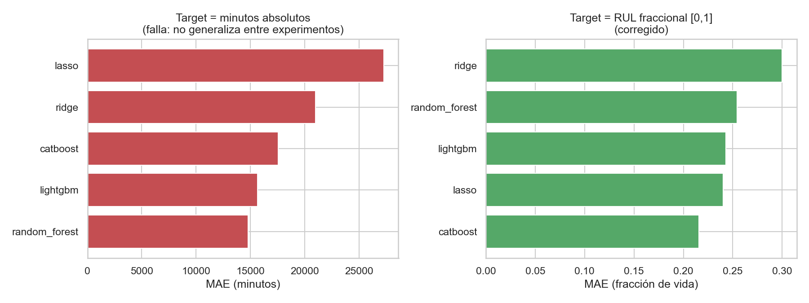
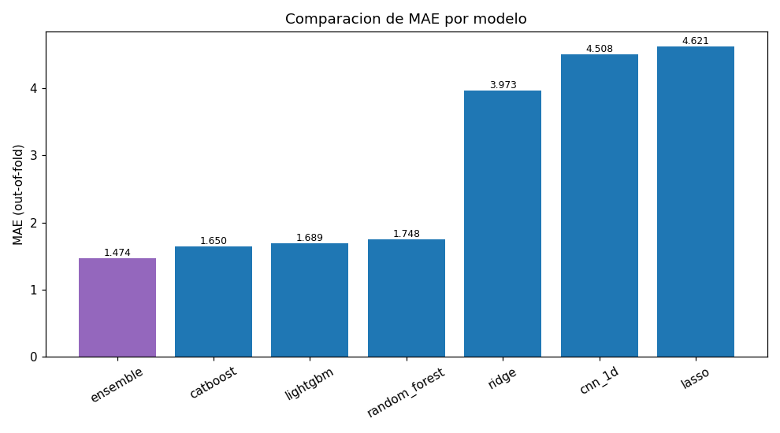

[ 🇺🇸 English ] | [ 🇨🇱 Leer en Español ](README.es.md)

# Failure Prediction from Signal Lab

The same underlying problem — predicting time-to-failure from a continuous signal — applied to three different domains and signal types: fleet operational data, vibration/acoustic sensor data, and continuous seismic acoustic data. Each folder is self-contained with its own README, dependencies, and tests. This repo replaces three separate single-domain repos that used to live on this profile.

## Techniques

| # | Domain | Folder | What it does |
|---|---|---|---|
| 01 | Mining fleet (multi-task) | [`01-mining-fleet-multitask-rul`](01-mining-fleet-multitask-rul) | CoxPH survival model + LightGBM + a PyTorch multi-task network + SHAP predict remaining useful life (RUL) for CAEX trucks from synthetic realistic fleet data, served via FastAPI/Streamlit. |
| 02 | Bearing vibration (real data) | [`02-bearing-vibration-rul`](02-bearing-vibration-rul) | FFT + spectral feature engineering + LightGBM/CatBoost predict remaining time-to-failure from the real NASA IMS Bearing Dataset, with a C++ signal-processing component. |
| 03 | Seismic acoustic signal | [`03-earthquake-acoustic-signal`](03-earthquake-acoustic-signal) | FFT + spectral features + LightGBM/CatBoost predict `time_to_failure` from continuous acoustic seismic data (LANL/Kaggle), served via DuckDB + CLI. |

## What the three domains found

Every number comes from an actual run of that folder's pipeline. The three share a thesis that the table makes visible:

| # | Domain | Headline number | What it actually says |
|---|---|---|---|
| **01** | Mining fleet (synthetic) | CoxPH C-Index **0.6246**; RUL MAE **513 h** over cycles up to ~16,700 h | Weeks of lead time, not a last-minute alarm. The survival model ranks the whole fleet **including units that haven't failed yet** (censored), which point predictions on failed units alone can't do |
| **01** | — same folder | Failure-type accuracy **1.000** at the last reading, **0.744** across every reading | The same classifier, two evaluation protocols, a 0.26 gap. Scoring only the final reading before failure is the easy question; scoring every reading in the cycle is the one an operator actually faces |
| **02** | Bearing vibration (**real** NASA IMS) | MAE **14,776 min → 0.216** of remaining life | Not a modeling win — a **target-definition** win. See below |
| **02** | — same folder | Optuna, 30 trials: 0.2159 → **0.2080** (3.7%) | Disclosed as modest on purpose: 3 GroupKFold folds, one per physical rig, is a thin signal for hyperparameter search |
| **03** | Seismic acoustic (LANL) | NNLS ensemble MAE **1.474**; 1D CNN on raw waveform **~4.5** | Gradient boosting on hand-engineered spectral features beats a CNN reading the raw signal by **2.7x**. The feature engineering is the model |

---

## Evidence

### The target definition beat every model choice

**How to read it — the two panels do not share units.** Left is MAE in absolute minutes, right is MAE as a fraction of remaining life [0,1]. They are not directly comparable bar-to-bar; what matters is that the left panel is a failure and the right one is a working model.

The first attempt predicted raw minutes-to-failure and produced errors in the **thousands of minutes** across leave-one-experiment-out folds. The cause wasn't the model: the three NASA IMS experiments run for radically different lengths — roughly 15, 7 and 44 days — so a model trained on two of them has never seen the third's absolute timescale. Switching the target to **fractional RUL** (`remaining_snapshots / total_snapshots`), the standard fix in the RUL literature for exactly this reason, made the problem tractable.

Two details worth noticing. First, the improvement is **3–8x depending on the model** — far larger than the 3.7% that 30 trials of Optuna bought on top of it. Second, **the model ranking itself changes**: Random Forest is the best of the five with the broken target and only fourth with the corrected one. A benchmark run on a mis-specified target would have selected the wrong model and reported it confidently.

### Hand-engineered features beat the CNN on the raw signal

**How to read it.** Out-of-fold MAE on `time_to_failure`, lower is better. Six individual models plus the NNLS-weighted ensemble in purple. The 1D CNN (`cnn_1d`) is the only model consuming the **raw acoustic waveform**; every other model sees FFT and statistical features computed from that same signal.

The CNN lands second-to-last at ~4.5, beaten 2.7x by CatBoost at 1.650 on engineered features. On a continuous seismic signal with this much data per segment, deciding *what to measure* — spectral energy bands, rolling statistics, percentiles — carried far more information than letting a convolutional network discover it. The ensemble at 1.474 then improves on the best single model by a further 11%, with NNLS choosing the weights rather than averaging blindly.

Note also the spread between the linear models: Ridge at 3.973 and Lasso at 4.621 are nowhere near the tree ensembles. The relationship between spectral features and time-to-failure is not linear, and the linear baselines are kept in the table to show that rather than assert it.

---

## The pattern across all three

Three domains — mining fleet telemetry, bearing vibration, seismic acoustics — and one shared conclusion:

> **The framing decisions beat the model choice, every time.**

- **The target** (02): redefining it was worth 3–8x. The best hyperparameter search on top of the right target was worth 3.7%.
- **The features** (03): spectral engineering on the raw signal beat a CNN reading that signal directly, by 2.7x.
- **The evaluation protocol** (01): the same failure-type classifier reports 1.000 or 0.744 depending on whether you score the last reading or every reading.

That is also why the three live in one repo. The domains sound unrelated — haul trucks, bearings, earthquakes — but the toolkit is the same: spectral and statistical feature engineering feeding gradient-boosted survival and regression models, validated with a grouping that respects the physical independence of each rig, run, or unit.

---

## Why one repo instead of three

Each technique is real, runnable, and independently tested — this isn't about hiding scope, it's about representing it accurately. Three repos in three unrelated-sounding domains (mining, bearings, earthquakes) hide the fact that they share the same core technique (spectral/statistical feature engineering into gradient-boosted survival/regression models); one lab makes that transferability the actual point — the same toolkit applied across mining operations, mechanical engineering, and geophysics.

## Running a technique

Each folder is self-contained — see its own README for the exact setup and entry point, real results from an actual run, and any honest negative findings.

## Author

Pablo Reyes — [github.com/Rxyxs](https://github.com/Rxyxs)
Code: MIT — see [LICENSE](LICENSE)
